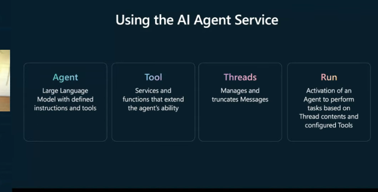

# AI Agents for Beginners

## Understanding AI Agents
- 
- AI Agents have some sort of trigger to make them perform some kind of tasks
- They allow us to perform specific tasks through natural language
- 
- 
- 
- 
- 
- 
- 
- 
- AutoGen is an open-source programming framework developed by Microsoft for building agentic AI applications. It enables developers to create intelligent agents that can act autonomously or collaborate with other agents to solve complex tasks. 
- AutoGen provides a framework for creating multiple agents that can communicate and work together to achieve goals.
- Agents can share information, divide tasks, and coordinate actions.
- AutoGen uses asynchronous messaging, allowing agents to interact in real-time through event-driven or request-response patterns.
- 
- 
- 