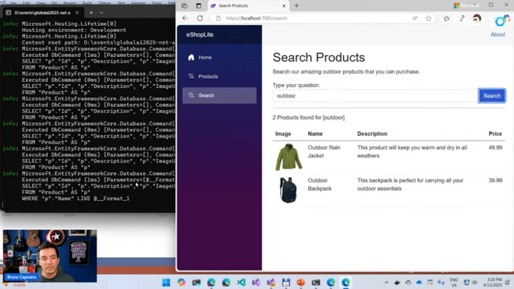

# AI Agents with .NET Aspire
- Refer to this link: https://github.com/microsoft/AI_Agents_Hackathon/discussions/58
- Agent is a Semi-autonomous software that can be given a goal and will work to achieve that goal without you knowing in advance exactly how it's going to do that or what steps it's going to take.
- 
- 
- 
- Semantic Kernel is an orchestration middleware that lets us add AI to our applications
- It is built specifically for enterprise app developers
- Extensions AI and Semantic Kernel both help to add AI to our code
- 
- We can use Semantic Kernel even to talk to local models like Ollama or ONNX
- Semantic Kernel is very extensible.
- We can use Semantic Kernel to talk to Vector Databases like Azure AI Search
- We can also use Open Telemetry with this
  
### AI Agents in Action
- A conversation with an Agent is called a Thread
- 
- 
- Refer to this github repo: https://github.com/Azure-Samples/aspire-semantic-kernel-creative-writer
- 

### Where does .NET Aspire fit in
- 
- 
- 
- 
- 
- 
- 
- 
- 
- 
- .NET Aspire sounds a lot like docker compose
- The builder.AddDistributedApplication method is part of the Aspire.Hosting framework in .NET, used for creating and managing distributed applications. It allows developers to define resources, services, and configurations for distributed systems
```c#
var builder = DistributedApplication.CreateBuilder(args);
var cache = builder.AddRedis("cache");
var inventoryDatabase = builder.AddPostgres("postgres").AddDatabase("inventory");
builder.AddProject<Projects.InventoryService>("inventoryservice")
       .WithReference(cache)
       .WithReference(inventoryDatabase);
builder.Build().Run();

```
- 
- 
- 
- 
- This command will give Azure Bicep Files
- 
- 
- 
- Bicep is a type of file which we can use to deploy to Azure
- It will try to deploy everything to Azure
- 
- It is connected to Azure AI Search Instance
- We can define multiple agents
- We can have expenses agent or sender agents
- 
- We can connect Agents to external data sources
- They can even connect to Azure Functions
- 
- 
- 
- 
- 
- 
- 
- 
- 
- 
- 
- 