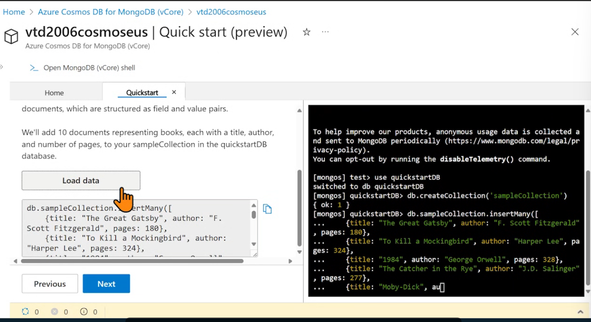
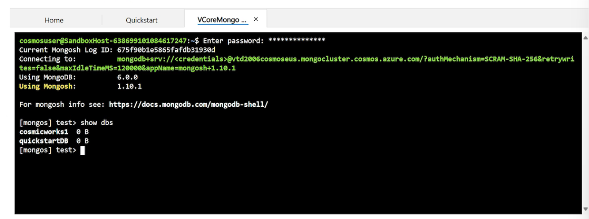
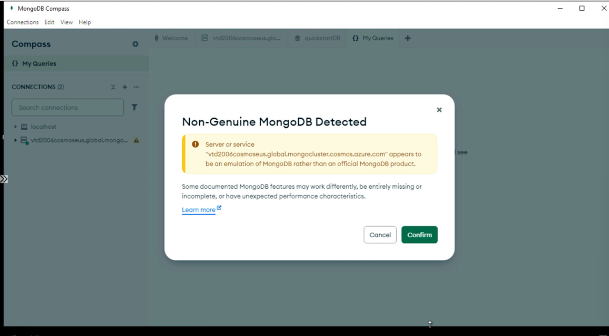
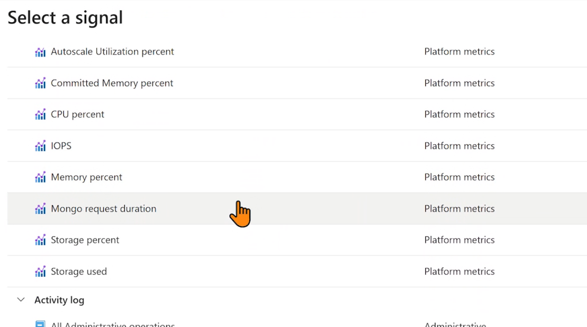
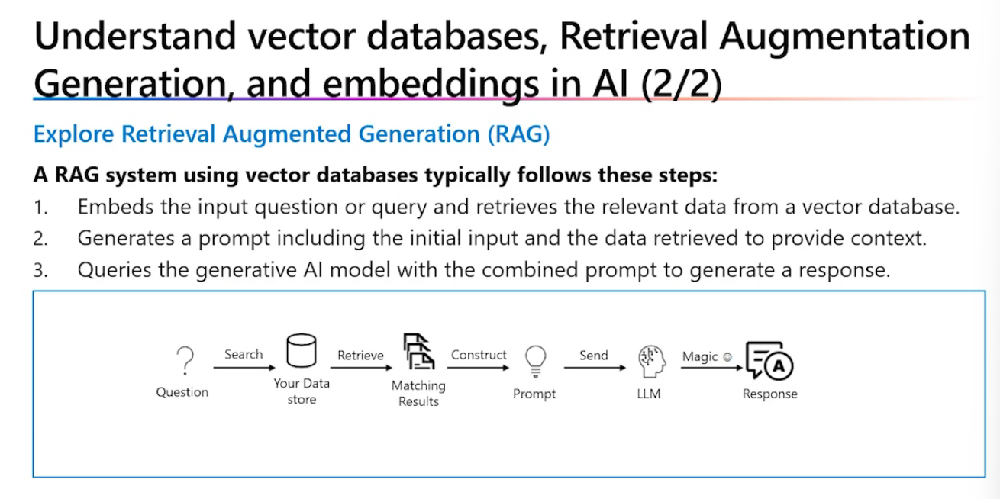
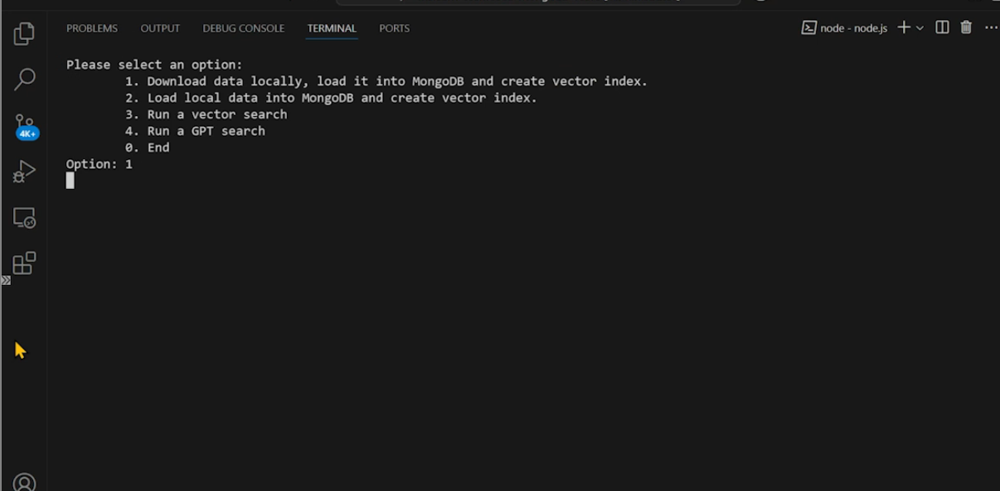

# Build an AI App with Azure using RAG
- 
- 
- 
- 
- 
- We can get started with a sample dataset
- We can connect to the mongo shell
- We can create a new collection for our data
- 
- We can load some sample data also
- 
- We can open our own mongodb shell
- 

## Migrate to vcore-based Azure Cosmos DB for MongoDB
- 
- 
- mongoexport packs our data into json files
- we need to use ssl flag and set it to ON
- mongoddump and mongorestore is preferred for large datasets
- We can also use Azure Data Studio
- 
- We can also use Azure Databricks
- 
- This is recommended approach for large datasets
- To import mongodb data use the mongoimport command
- 
- We can use the mongodump command for export
- 
- To move data into our project, we can use mongorestore command
- We can check the mongodb compass app to check if all the data has been imported
- 
- 
  
### Manage a vCore-based Azure Cosmos DB for MongoDB Cluster
- 
- 
- We can need to setup Availability Zones.
- There is no automatic failover. We need to plan a disaster recovery plan.
- 
- 
- 
- 
- 
- The Cluster Tier and Storage can be scaled independently.
- In High availability we can create standby replicas of every shard.
- This obviously increases costs
- 
- 
- 
- 
- 
- Run the node.js application
- First load local data into mongodb and create the vector index.
- Then run the workload on the database
- 
- We can also setup an alert rule
- We can do the same through alerts tab also
- Action Groups involve notifying multiple people
- We need to setup the signal we wish to respond to
- 
- 
- We can setup an alert based on a custom log search. This takes more time though compared to specific metrics
- 
- We can insert a custom KQL query directly.
- 
- We can notify our administrators using Action Groups
- 
- 
- 
- 

## Build Azure AI copilot for building RAG applications with Azure CosmosDB for MongoDB 
- 
- 
- 
- 
- 2 different type of vector indexes available in Azure
- 
- 
- 
- 
- 
- 
- 
- 
- 
- 
- The real power of Vector Search comes with ChatGPT's NLP capabilities.
  
## Hosting a Front End app for users to interact with our vector search
- 
- 
- We need to create a docker file to host our application
- 
- Note that it is running app.js
- We need to run a docker build command to create a container image based on data in Dockerfile.
- 
- We need to upload this image to ACR.
- TO run the image locally, we can use docker run command
- 
- 
- 
- Create a K8s cluster with this command
- 
- We can configure kubectl locally like this
- 
- 
- 
- We can deploy our nodejs app to K8s cluster.
- just use the kubectl -f deployment.yaml command
- To get IP of our application use this command
- 
- 
- 