# Generative AI with Azure AI Services
- 
- Machine Learning is a form of AI that is able to learn without explicit programming by human
- Some ML algorithms are specialized in training themselves to detect patterns; this is called deep learning.
- 
- Generative AI is AI capable of creating new content using models trained on existing data.
- It generates text,images, audio and video
- It is powered by advanced machine learning models such as transformers, GANs(Generative Adversarial Networks) and others
- Examples of GenAI are ChatGPT(for text), DALL-E(for images) and MusicLM(for audio)
- GenAI is not fully autonomous. It relies on training data and models built by humans. Cant think or reason independently.
- AI Models can inherit biases from the data they are trained on.
- GenAI content may not always be accurate or reliable. 
- AI is a tool meant to augment human capabilities, not replace them entirely.

## Ethical implications of AI
- AI has potential to unlock all kinds of opportunities for businesses, governments and society.
- It should promote non-discrimination and fairness.
- It should not violate human rights.
- It must minimize environmental impact, reduce carbon footprint
- It should follow privacy and data protection laws
- It should be accountable.


## Machine Learning Basics
- Machine Learning is a form of AI that is able to learn without explicit programming by human
- Some ML algorithms are specialized in training themselves to detect patterns; this is called deep learning.
- 2 types of machine learning: Supervised learning(map points between input and output) and unsupervised learning(discover patterns and relationships using unlabelled data)
- Unsupervised learning tries to find clusters of data
- Additional type of ML is Semi-supervised learning(uses both labelled and unlabelled data)
- We also have reinforcement learning which mimics the trial and error learning process that humans use to achieve their goals e.g autonomous vehicles.
- 
- 
- 

## Understanding Neural Networks
- They are computational models designed to recognize patterns and make decisions based on data. 
- 
- There are two main processes for a neural network.
- There is the forward propagation, where data moves from the input layer through the hidden layers to the output layer and each neuron.
- So each circle here in that hidden layer that represents a neuron, it applies some mathematical function to the input.
- That's where that weighting comes.
- So the higher the mathematical, the output of it or whatever parameters there are to determine what's a good, um, outcome of that mathematical operation or not, it will give it more or less precedence towards a final response.
- We have back propagation where the network adjusts its weights based on the error of its predictions, improving accuracy over time. So that is why you'll see generative AI getting smarter each time as well. And sometimes they ask for feedback.
- 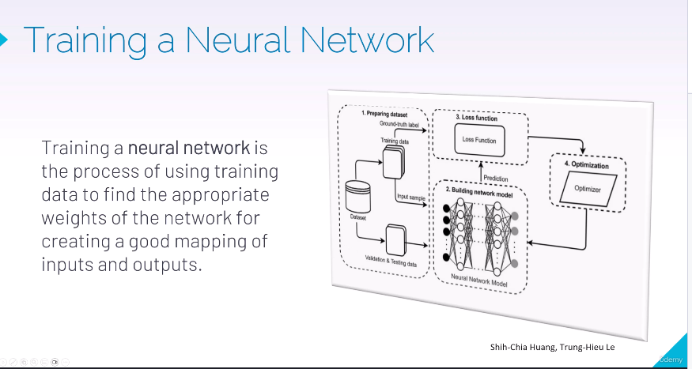

## Introduction to ML.NET
- Ml.net is an open source, cross-platform machine learning framework that is designed specifically for .Net developers, it allows us to build, train and deploy machine learning models using C# or F#.
- So with this, we also get AutoML capabilities which help us to automatically build and tune models.
- We also have Azure AI Services: Set of cloud based artificial intelligence tools and API that allow us to build AI powered applications without needing in-depth AI expertise.
- Another thing is Semantic Kernel which is an open source framework which allows us to integrate LLMs in our applications through this library.
- We have ONNX(Open Neural Network Exchange): Open source format for representing ML Models.
- We have PyTorch from Facebook and TensorFlow which comes from Google.
- We have CnTk(Microsoft Cognitive Toolkit) from Microsoft for deep learning. Helps to build applications optimized for speech, image recognition and text.
- 
- 
- 
- 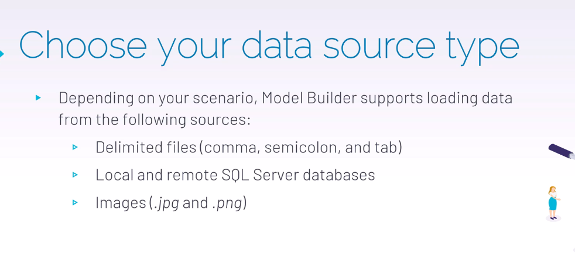
- 
- 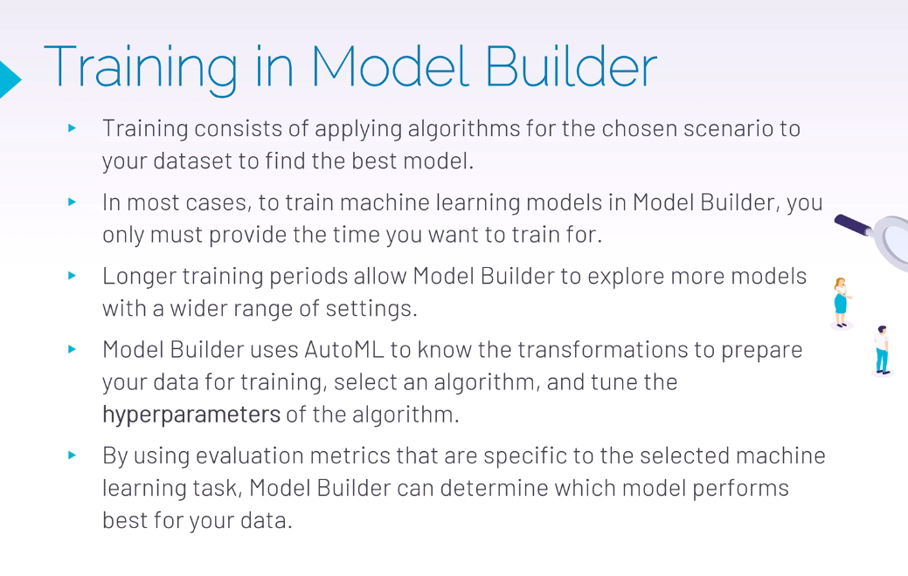
- 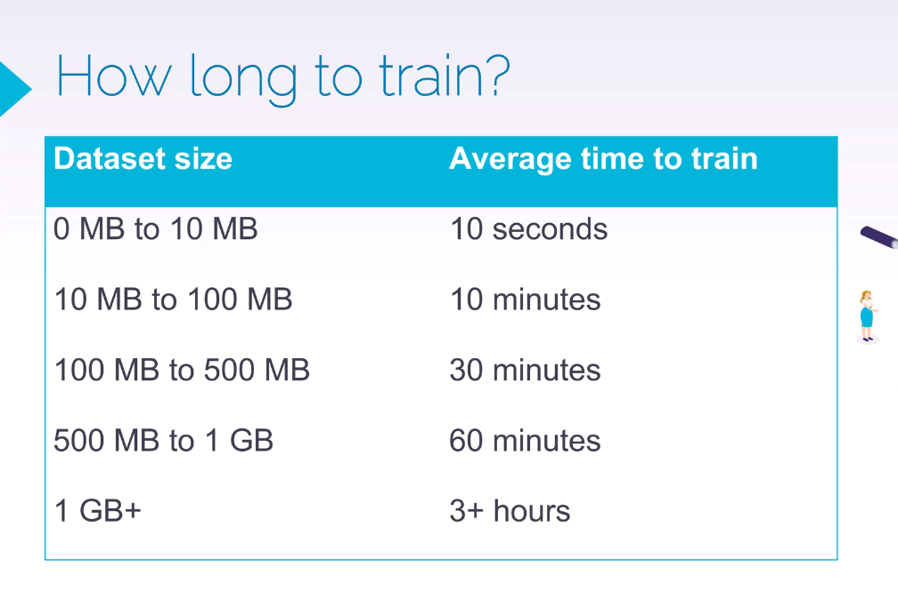
- We have a concept of overfitting, which basically means that the model has been trained on the data a bit too well such that newer data seems like rubbish to it, so we don't want it to be too familiar and too confident with just the data set it got.
```c#
//Use the following code to interact with the Predictive Model and predict values using it
//Load sample data
var sampleData = new PredictiveModel.ModelInput()
{
    UDI = 2F,
    Product_ID = @"L47181",
    Air_temperature = 298.2F,
    Process_temperature = 308.7F,
    Rotational_speed = 1408F,
    Torque = 46.3F,
    Tool_wear = 3F,
};

//Load model and predict output
var result = PredictiveModel.Predict(sampleData);


```

- We can add a machine learning model to our project like this
- 
- Once we train our model with the sample dataset we can use it to predict values like this:
```c#
using MLSampleAppConsole;

//Prompt the user for input values
//Build the input model from values
PredictiveModel.ModelInput modelInput = new()
{
    UDI = 2F,
    Product_ID = @"L47181",
    Air_temperature = 298.2F,
    Process_temperature = 308.7F,
    Rotational_speed = 1408F,
    Torque = 46.3F,
    Tool_wear = 3F,
};

Console.WriteLine("Comparing actual Machine_failure with predicted Machine_failure from sample data...\n\n");


//Passing input values into predictive model
var scoresWithLabel = PredictiveModel.PredictAllLabels(modelInput);

Console.WriteLine($"{"Class",-40}{"Score",-20}");
Console.WriteLine($"{"-----",-40}{"-----",-20}");

foreach (var score in scoresWithLabel)
{
    Console.WriteLine($"{score.Key,-40}{score.Value,-20}");
}
Console.WriteLine($"{"-----",-40}{"-----",-20}");
var modelOutput = PredictiveModel.Predict(modelInput);
Console.WriteLine("Single Prediction Result");
Console.WriteLine($"UDI: {modelOutput.UDI}");
Console.WriteLine($"Product_Id: {modelOutput.Product_ID}");
Console.WriteLine($"Air_Temperature: {modelOutput.Air_temperature}");
Console.WriteLine($"Tool_wear: {modelOutput.Tool_wear}");
Console.WriteLine($"Machine_failure: {modelOutput.Machine_failure}");


Console.WriteLine("------------Done------------");
Console.ReadKey();


```

## Consuming a model from .NET API
- We can use the following code to consume the PredictiveModel like this
```c#
// This file was auto-generated by ML.NET Model Builder. 
using Microsoft.AspNetCore.Builder;
using Microsoft.Extensions.DependencyInjection;
using Microsoft.Extensions.ML;
using Microsoft.OpenApi.Models;
using Microsoft.ML.Data;
using System.Drawing;
using System.IO;
using System.Threading.Tasks;

// Configure app
var builder = WebApplication.CreateBuilder(args);
builder.Services.AddPredictionEnginePool<PredictiveModel.ModelInput, PredictiveModel.ModelOutput>()
    .FromFile("PredictiveModel.mlnet");

builder.Services.AddEndpointsApiExplorer();

builder.Services.AddSwaggerGen(c =>
{
    c.SwaggerDoc("v1", new OpenApiInfo { Title = "My API", Description = "Docs for my API", Version = "v1" });
});
var app = builder.Build();

app.UseSwagger();

if (app.Environment.IsDevelopment())
{
    app.UseSwagger();
    app.UseSwaggerUI(c =>
    {
        c.SwaggerEndpoint("/swagger/v1/swagger.json", "My API V1");
    });
}


// Define prediction route & handler
app.MapPost("/predict",
    async (PredictionEnginePool<PredictiveModel.ModelInput, PredictiveModel.ModelOutput> predictionEnginePool, PredictiveModel.ModelInput input) =>
        await Task.FromResult(predictionEnginePool.Predict(input)));

// Run app
app.Run();


```
## Generative AI Tools and Copilots
- Generative AI helps to create new content
- People interact with generative AI through copilot or ChatGPT.
- They accept natural language input and return appropriate response in natural language, images or code.
- Generative AI applications are powered by language models, a specialized machine learning model that you can use to perform NLP tasks.
- These applications can determine sentiment by classifying natural language text.
- They can also summarize text

### Using language models
- 

### Using Azure OpenAI models
- Azure Open AI hosts pretrained foundational models in Model Catalog of Azure Open AI
- 

### Understanding Copilots
- 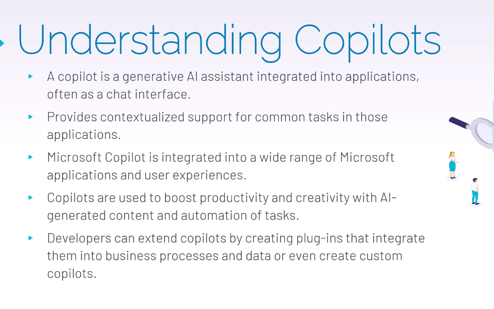
- 
- 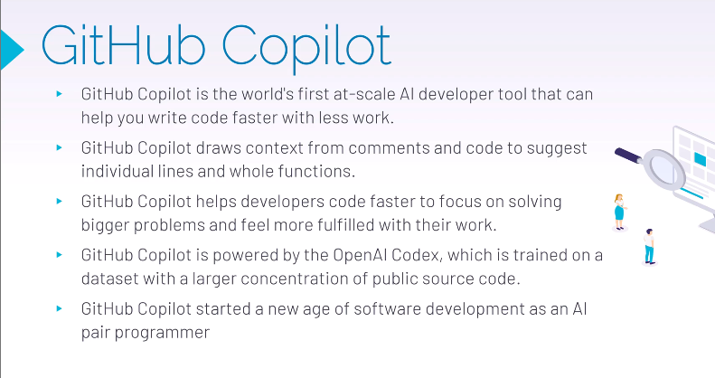
- 
- 
- For inline chat with Copilot click on CTRL + I
- 

## Azure AI Services Fundamentals
- 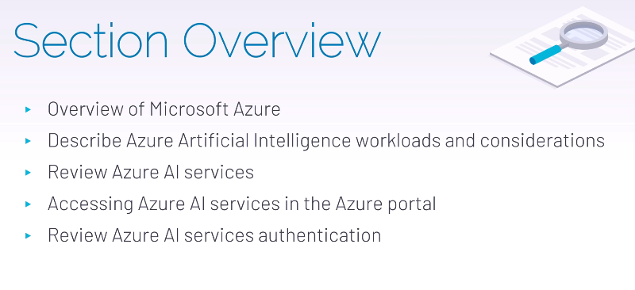
- 
- 
- 
- 
- 
- 
- 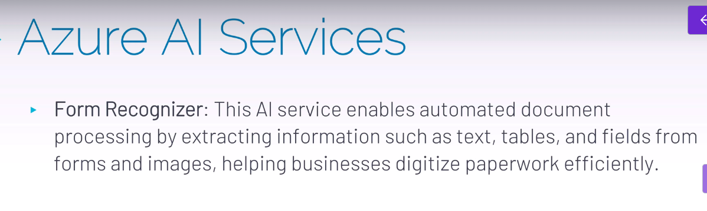

### Provision Azure AI Services
- 
- 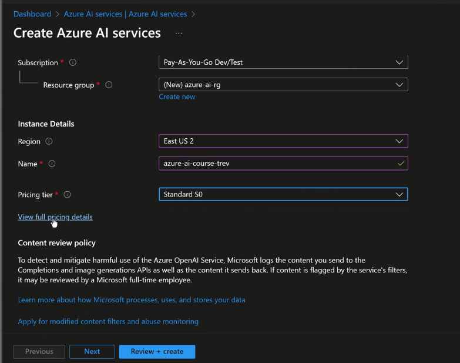
- 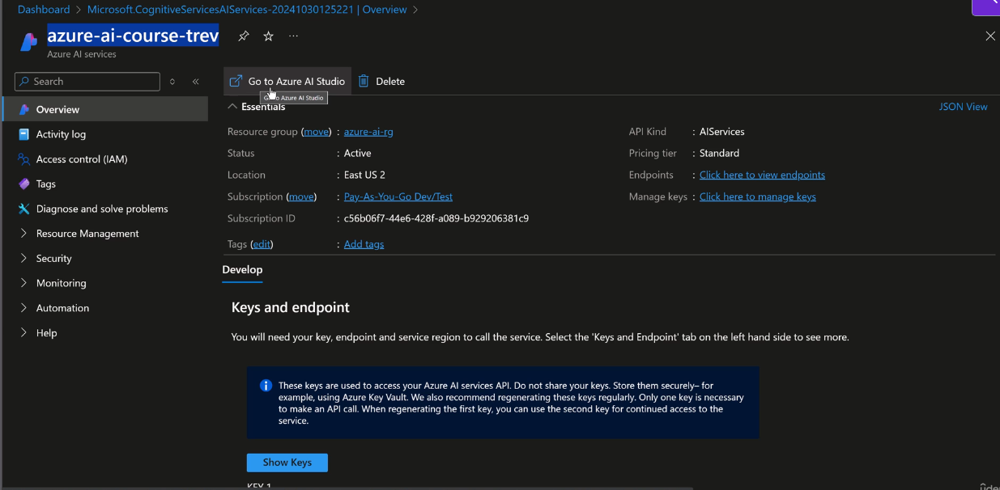
- 

### Exploring Content Safety Studio
- 
- Helps to moderate content which is offensive, risky or otherwise undesirable.
- 
- 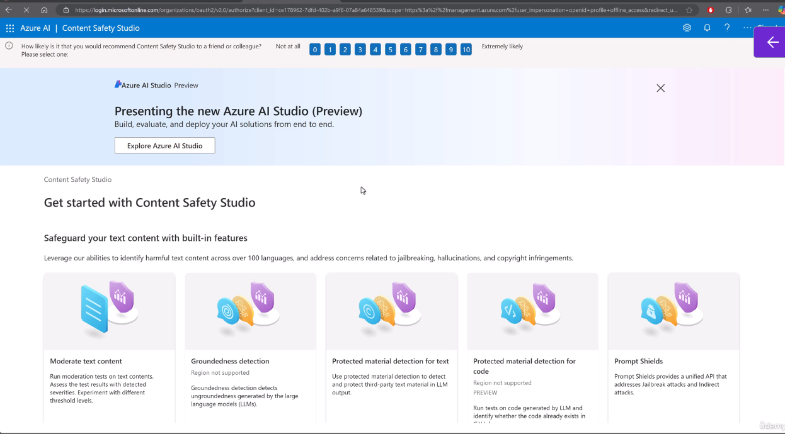
- 
- Change Access Control and Add role assignment and choose cognitive services user.
- 
- 
- The model is already kind of trained. Its deep learning and everything on what's safe and unsafe things may look like.
- So you as a developer don't have to worry about training it.
- It's already a well trained model.
- What you can do is configure filters and thresholds so you can say, all right, well I want to block even the lowest amount of violence, or I really only want to block things that are extremely violent.
- 
- 
- 
- 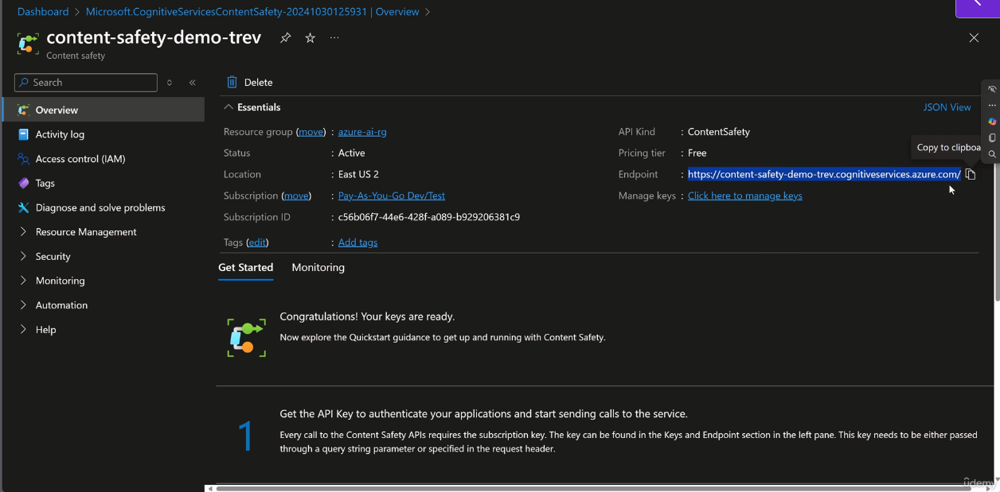
- We have an endpoint for the content safety studio and we can call it.
- Content Safety Demo is a console application demonstrating how to use Azure Content Safety for text analysis and content moderation. This demo app analyzes text input, detects potentially harmful or inappropriate content, and flags it according to specified safety policies. Ideal for developers and content managers, this application showcases how Azure Content Safety can be integrated into .NET applications to enhance user safety and maintain community guidelines.
```c#
public class Program
{
    static async Task Main(string[] args)
    {
        // Replace the placeholders with your own values
        string endpoint = "";
        string subscriptionKey = "";

        // Initialize the ContentSafety object
        ContentSafety contentSafety = new ContentSafety(endpoint, subscriptionKey);

        // Set the media type and blocklists
        MediaType mediaType = MediaType.Text;
        string[] blocklists = { "hateful-words" };

        // Set the content to be tested
        Console.WriteLine("Enter the content to be tested:");
        string content = Console.ReadLine();

        // Detect content safety
        DetectionResult detectionResult = await contentSafety.Detect(mediaType, content, blocklists);

        // Set the reject thresholds for each category
        Dictionary<Category, int> rejectThresholds = new Dictionary<Category, int> {
            { Category.Hate, 4 }, { Category.SelfHarm, 4 }, { Category.Sexual, 4 }, { Category.Violence, 4 }
        };

        // Make a decision based on the detection result and reject thresholds
        Decision decisionResult = contentSafety.MakeDecision(detectionResult, rejectThresholds);
    }
}


    /// <summary>
    /// Makes a decision based on the detection result and the specified reject thresholds.
    /// Users can customize their decision-making method.
    /// </summary>
    /// <param name="detectionResult">The detection result object to make the decision on.</param>
    /// <param name="rejectThresholds">The reject thresholds for each category.</param>
    /// <returns>The decision made based on the detection result and the specified reject thresholds.</returns>
    public Decision MakeDecision(DetectionResult detectionResult, Dictionary<Category, int> rejectThresholds)
    {
        Dictionary<Category, Action> actionResult = new Dictionary<Category, Action>();
        Action finalAction = Action.Accept;
        foreach (KeyValuePair<Category, int> pair in rejectThresholds)
        {
            if (!VALID_THRESHOLD_VALUES.Contains(pair.Value))
            {
                throw new ArgumentException("RejectThreshold can only be in (-1, 0, 2, 4, 6)");
            }

            int? severity = GetDetectionResultByCategory(pair.Key, detectionResult);
            if (severity == null)
            {
                throw new ArgumentException($"Can not find detection result for {pair.Key}");
            }

            Action action;
            if (pair.Value != -1 && severity >= pair.Value)
            {
                action = Action.Reject;
            }
            else
            {
                action = Action.Accept;
            }
            actionResult[pair.Key] = action;

            if (action.CompareTo(finalAction) > 0)
            {
                finalAction = action;
            }
        }

        // blocklists
        if (detectionResult is TextDetectionResult textDetectionResult)
        {
            if (textDetectionResult.BlocklistsMatch != null &&
                textDetectionResult.BlocklistsMatch.Count > 0)
            {
                finalAction = Action.Reject;
            }
        }

        Console.WriteLine(finalAction);
        foreach (var res in actionResult)
        {
            Console.WriteLine($"Category: {res.Key}, Action: {res.Value}");
        }

        return new Decision(finalAction, actionResult);
    }
}

```
- We can setup blocklists or keywords that we want to block
- Content Safety can even look at images
- 
- 
- 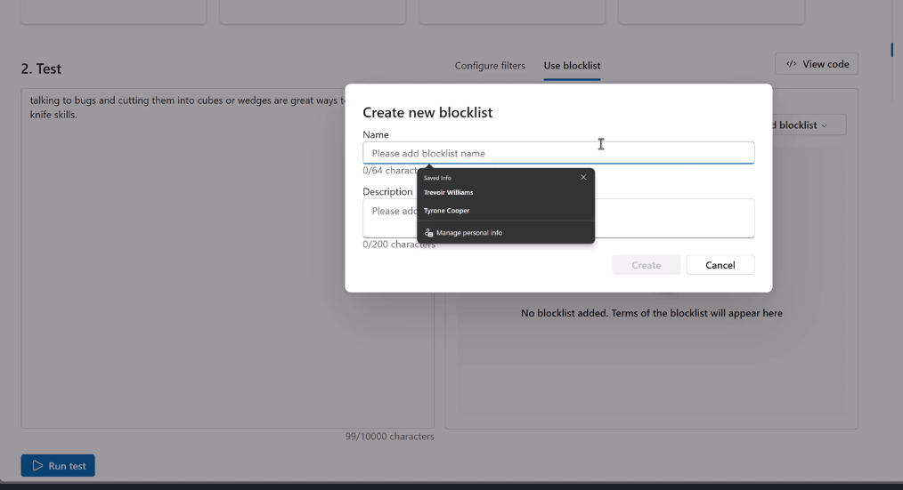
- 
- 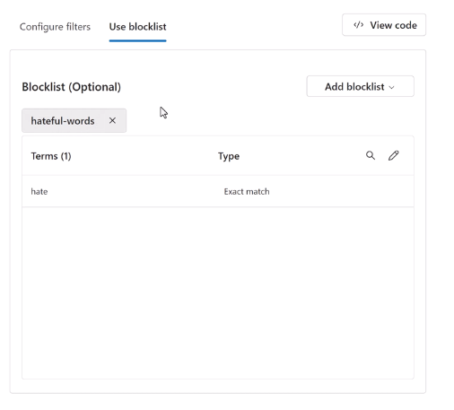
- 
- 


## Creating solutions with .NET and Azure Cognitive Services
- 
- 
- 
- 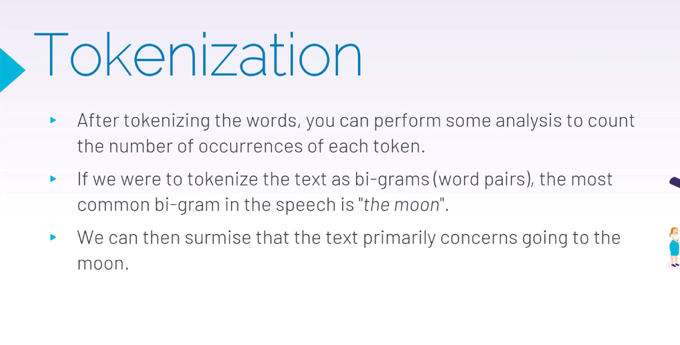
- 
- 
- 

### Text Analysis with Azure AI
- 
- 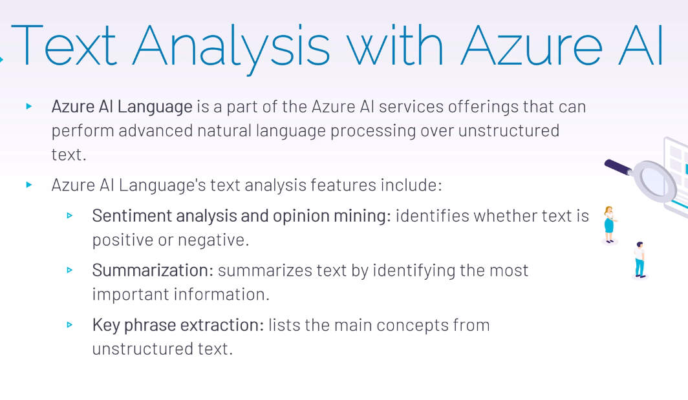
- First provision the Azure AI Services
- 
- 
- 
- 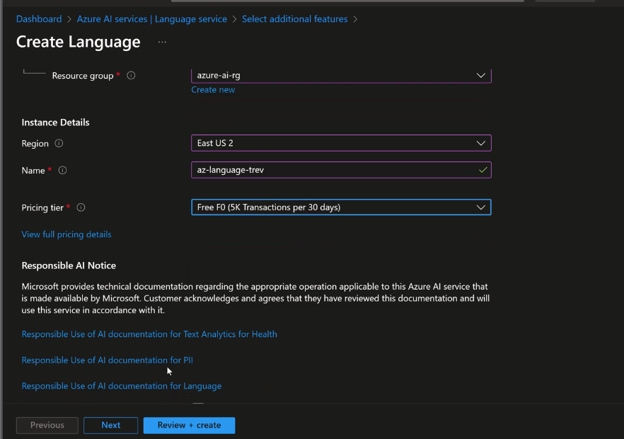
- 
- 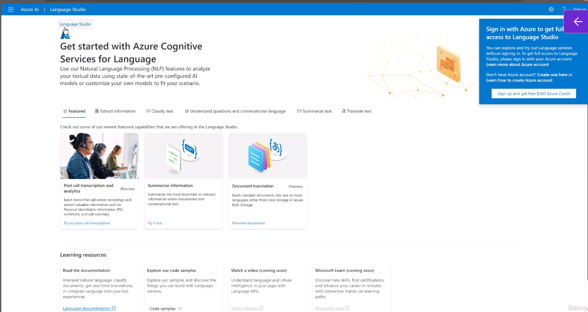
- 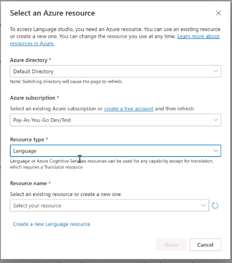
- 
- 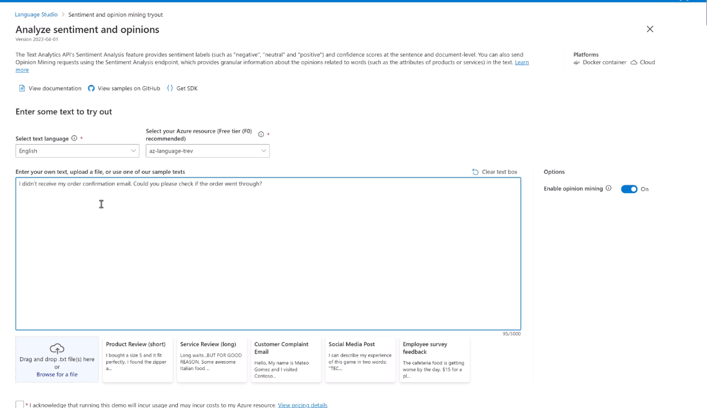
- 
- 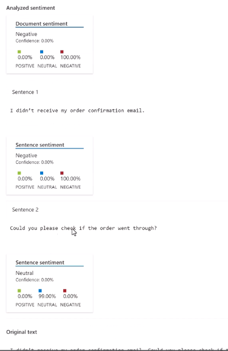
- As we can see it analyzed the sentences and classified whether the sentiment of the sentences was positive or negative.

### Create a Sentiment Analysis application
- 
- 
```c#
using Azure;
using Azure.AI.TextAnalytics;

string key = "MyKey";
string endpoint = "https://az-language-nish.cognitiveservices.azure.com/";


AzureKeyCredential azureKeyCredential = new AzureKeyCredential(key);
Uri languageEndpoint = new Uri(endpoint);

var client = new TextAnalyticsClient(languageEndpoint,azureKeyCredential);

var sentences = new List<string>
{
    "I love the new Italian restaurant. THe pastaa was very good",
    "We need to schedule a meeting to discuss the Q3 projections and finalize the budget"
};


//Pass a single line of text
DocumentSentiment sentenceToAnalyze = client.AnalyzeSentiment(sentences[0]);

//Pass a collection of text
// Summary:
//     Include Opinion Mining = Whether to mine the opinion of a sentence and conduct more granular analysis
//     around the targets of a product or service (also known as Aspect-Based sentiment
//     analysis). If set to true, the returned Azure.AI.TextAnalytics.SentenceSentiment.Opinions
//     will contain the result of this analysis.
AnalyzeSentimentResultCollection sentencesToAnalyze = client.AnalyzeSentimentBatch(sentences,
    options: new AnalyzeSentimentOptions() {IncludeOpinionMining = true });

foreach (AnalyzeSentimentResult sentence in sentencesToAnalyze)
{
    Console.WriteLine($"Sentence Sentiment:{sentence.DocumentSentiment.Sentiment}");

    Console.WriteLine($"Positive:{sentence.DocumentSentiment.ConfidenceScores.Positive}");

    Console.WriteLine($"Neutral:{sentence.DocumentSentiment.ConfidenceScores.Neutral}");

    Console.WriteLine($"Negative:{sentence.DocumentSentiment.ConfidenceScores.Negative}");

    foreach(var sentenceSentiment in sentence.DocumentSentiment.Sentences)
    {
        Console.WriteLine($"Opinion -Aspect: {sentenceSentiment.Text}");

        foreach(var sentenceOpinion in sentenceSentiment.Opinions)
        {
            Console.WriteLine($"Sentence Opinion: {sentenceOpinion.Target.Sentiment}");

            foreach(AssessmentSentiment assessment in sentenceOpinion.Assessments)
            {
                Console.WriteLine($"Opinion assessment: {assessment.Text}");
            }
        }

    }
}


```
- 
- 

## Understanding Computer Vision
- 
- 

## Image Processing through Machine Learning
- 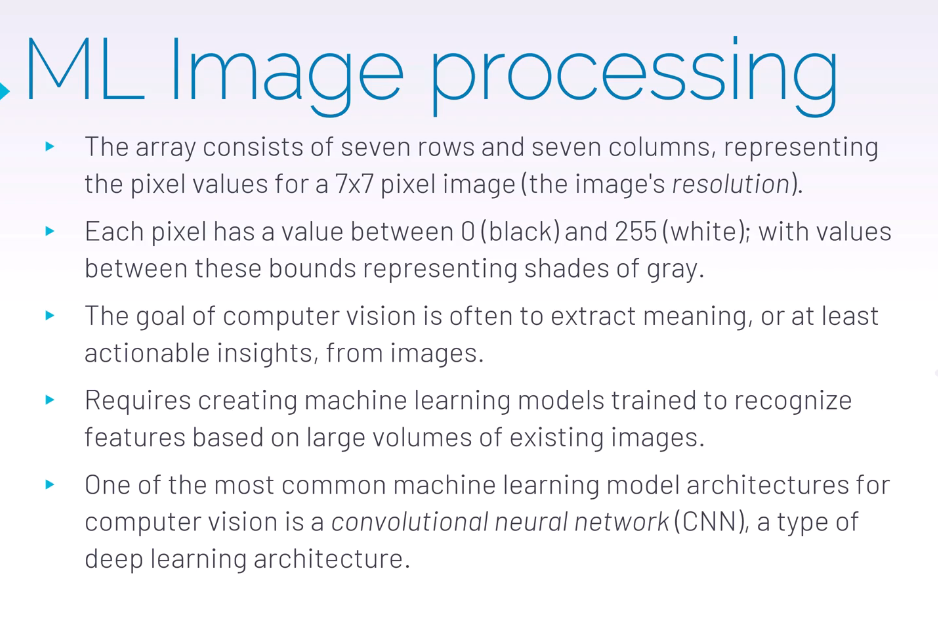
- 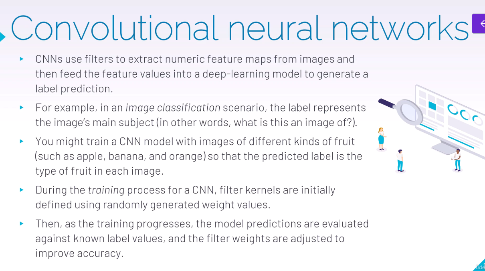
- Filters modify the image pixels values and create a visual effect around that image.
-  filter is one or more arrays of pixel values which are called pixel kernels.
-  
-  
-  To the left is a grayscale image of what I think is a banana.
- After we have applied that filter, we then see to the right that it has a darker scale on it.
- So now the actual subject of the image has more defined borders and it's very visible to the computer.
- So once again the computer is going to process things differently from how we, the human beings, do.

### How does the Machine Learning and CNN work?
- Step one images with no labels like apples, oranges, bananas, etc. are fed into the network to train the model.
- One or more layers of filters is used to extract features from each image.
- As it is fed through the network, the filter kernels start to randomly assign weights and generate arrays of numeric values called feature maps.
- Then the feature maps are flattened into a single dimensional array of feature values.
- The feature values are then fed into a fully connected neural network, and then the output layer of the neural network uses a softmax or similar function to produce a result that contains a probability value for each possible class.
- 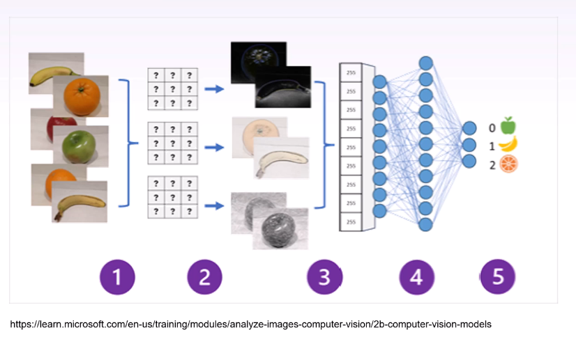

### Transformers
- 
- 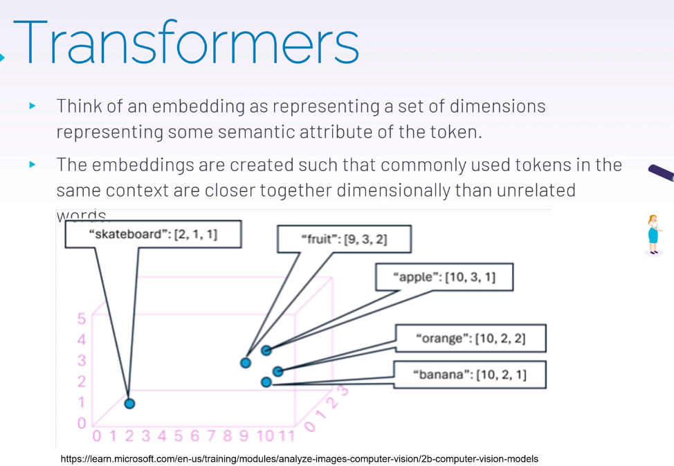
- 
- This effective means that that we can map features from images to regular text embeddings and build an association between images and natural text.
- This can prove useful in say: captioning images
- 

## Azure AI Vision
- 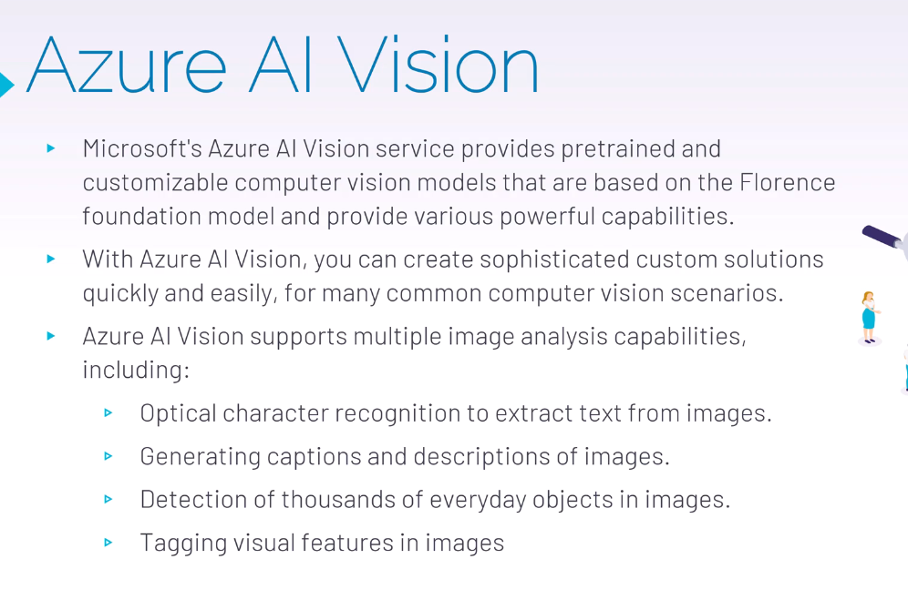
- 
- 
- 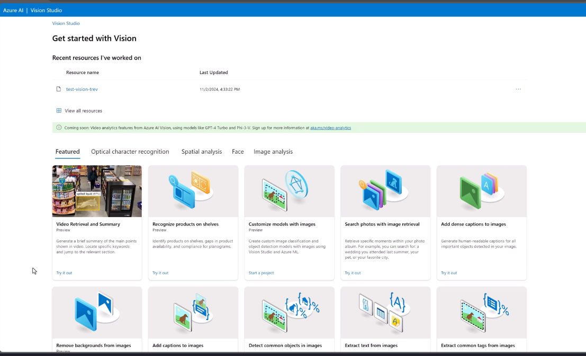
- 
- 
- 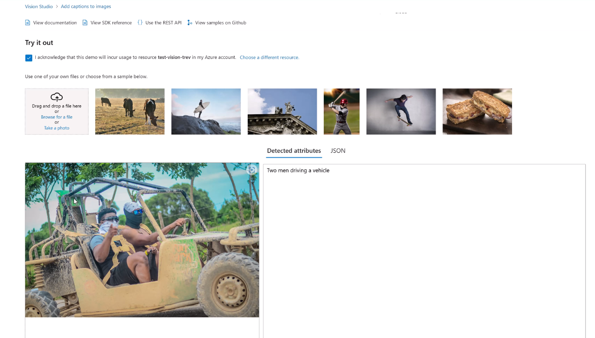
- 

### Building an Image Captioning Web Application using Azure AI Vision
- This Image Captioning Web Application uses Azure AI Vision to analyze uploaded images and generate descriptive captions. Users can upload an image through the web interface, and Azure AI Vision’s advanced image processing capabilities will generate an appropriate caption based on the content of the image. This application demonstrates how to integrate Azure’s image analysis features into a modern web application to enhance user engagement and accessibility.
- Image Upload: Users can upload images in various formats (JPEG, PNG, etc.).
- Image Captioning with Azure AI Vision: Automatically generates a descriptive caption for each uploaded image using Azure’s image analysis service.
- Real-Time Caption Display: Displays the generated caption to users in real time, enhancing user experience and accessibility.

#### Example Workflow
- User Uploads Image: The user uploads an image of a sunset over the ocean.
- Azure AI Vision Generates Caption: The backend sends the image to Azure, which analyzes it and returns a caption like “A beautiful sunset over the ocean with colorful skies.”
- Caption Displayed: The caption appears on the webpage below the image, providing the user with meaningful feedback.
- We need to add the nuget package: Azure.AI.Vision.ImageAnalytics
```json

  <ItemGroup>
    <PackageReference Include="Azure.AI.Vision.ImageAnalysis" Version="1.0.0" />
  </ItemGroup>

```
- We can code it as follows:
```html
//Index.cshtml
@page
@model IndexModel
@{
    ViewData["Title"] = "Azure AI Vision Demo";
}

<div class="text-center">
    <h1 class="display-4">Azure AI Vision Demo</h1>
    <p>
        An intelligent app to assess an image generate a caption
    </p>
</div>

<div class="row">
    <div class="col-md-6">
        <form method="post" enctype="multipart/form-data">
            <div class="form-group">
                <label asp-for="Input.Image">Upload Image</label>
                <input asp-for="Input.Image">
            </div>
            <button type="submit" class="btn btn-primary">Submit for Assessment</button>
        </form>
    </div>
    <div class="col-md-6">
        
        <p>@Model.Input.ImageCaption</p>
    </div>


```
```c#

//Index.cshtml.cs
using Azure;
using Azure.AI.Vision.ImageAnalysis;
using Microsoft.AspNetCore.Mvc;
using Microsoft.AspNetCore.Mvc.RazorPages;

namespace AzureComputerVision.Pages;

public class IndexModel : PageModel
{

    private readonly ILogger<IndexModel> _logger;

    public class ImageCaptionModel
    {
        public IFormFile Image { get; set; }
        public string ImageData { get; set; }
        public string ImageCaption { get; set; }
    }

    [BindProperty]
    public ImageCaptionModel Input { get; set; } = new();

    public IndexModel(ILogger<IndexModel> logger)
    {
        _logger = logger;
    }

    public void OnGet()
    {

    }

    public async Task<IActionResult> OnPostAsync()
    {
        string endpointUrl = "";
        string key = "";

        ImageAnalysisClient client = new(new Uri(endpointUrl), new AzureKeyCredential(key));

        if (Input.Image != null)
        {
            using MemoryStream ms = new();
            await Input.Image.CopyToAsync(ms);
            ms.Position = 0;
            Input.ImageData = Convert.ToBase64String(ms.ToArray());

            ImageAnalysisResult imageAnalysisResult = await client.AnalyzeAsync(BinaryData.FromStream(ms), VisualFeatures.Caption, new ImageAnalysisOptions
            {
                GenderNeutralCaption = true
            });

            Input.ImageCaption = $"Caption: {imageAnalysisResult.Caption.Text} | Confidence: {imageAnalysisResult.Caption.Confidence}";

        }

        return Page();
    }
}

```
- 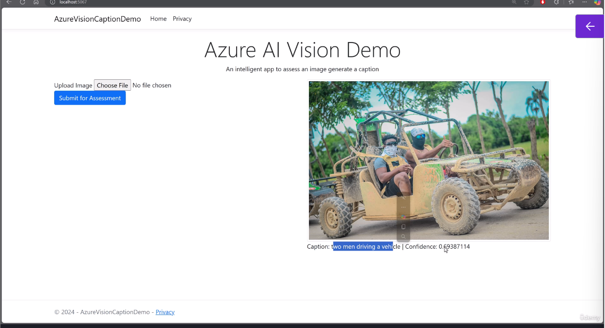


### Document Intelligence
- 
- 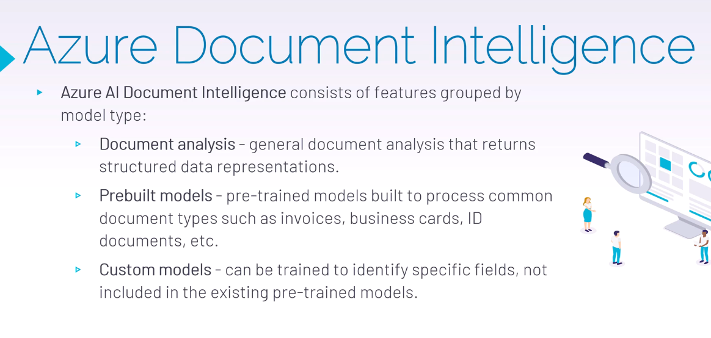
- We can build models that can process custom forms or documents
- 
- 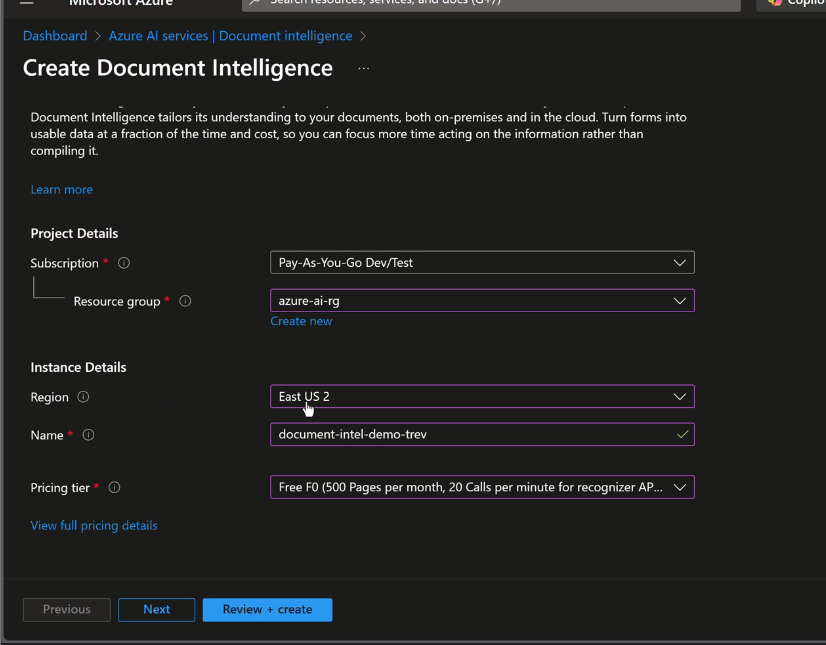
- 
- 
- 
- 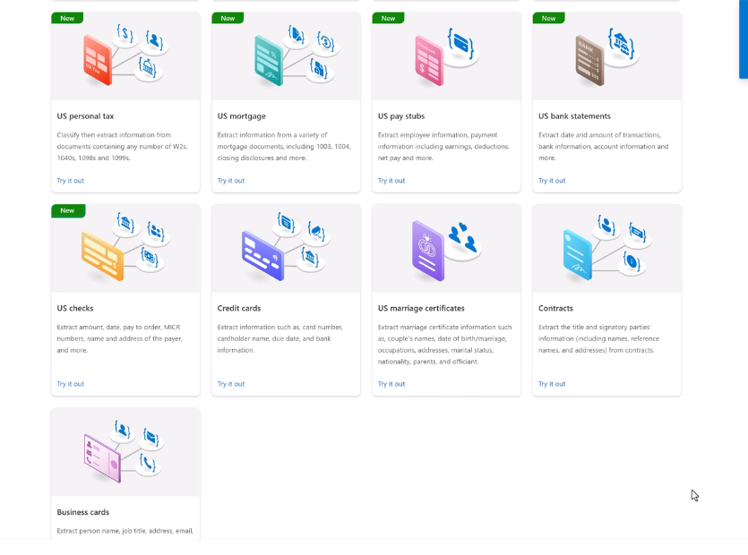
- 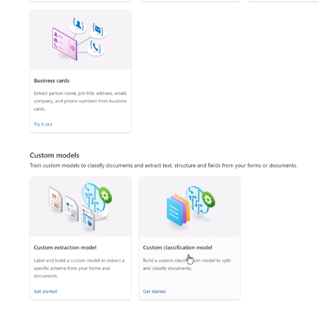
- 
- Document Intelligence gives more useful information from the png image we uploaded such as the items in the receipt, can give quantity and price and address of the restaurant.
- 
- It basically extracts json from the document
- 
- It also generates the sample C# code to use the document
- 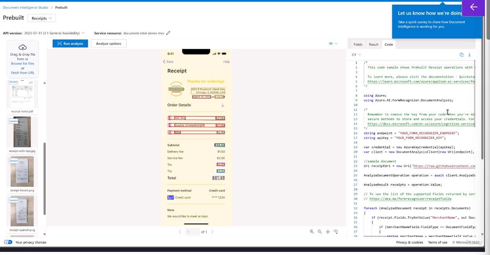

### Building a Receipt Analysis Application
- Add the following nuget package:
```json
<ItemGroup>
    <PackageReference Include="Azure.AI.FormRecognizer" Version="4.1.0" />
  </ItemGroup>

```
- This Document Processing Web Application uses Azure AI Document Intelligence (formerly known as Azure Form Recognizer) to analyze uploaded documents, such as receipts, invoices, or other structured forms. The application extracts key information like date, total amount, vendor details, and itemized entries, providing a powerful solution for automating document processing workflows.
- Document Upload: Allows users to upload various types of documents (PDF, JPEG, PNG).
- Automated Data Extraction with Azure AI Document Intelligence: Utilizes Azure’s document analysis capabilities to extract key information from uploaded documents.
- Real-Time Results Display: Displays the extracted data in a structured format on the webpage, providing instant feedback and insights.
- Here is the code
```html
@page
@model IndexModel
@{
    ViewData["Title"] = "Azure Document Intelligence Demo";
}

<div class="text-center">
    <h1 class="display-4">Azure Document Intelligence Demo </h1>
    <p>An intelligent documents and their data using document Intelligence</p>
</div>

<div class="row">
    <div class="col-md-6">
        <form method="post" enctype="multipart/form-data">
            <div class="form-group">
                <label asp-for="Document">Upload Documet</label>
                <input asp-for="Document">
            </div>
            <button type="submit" class="btn btn-primary">Submit for Assessment</button>
        </form>
    </div>
    <div class="col-md-6">
        @if (Model.Result != null)
        {
            <h4>Analysis Result</h4>
            <dl>
                <dt>Merchant Name</dt>
                <dd>@Model.Result.MerchantName</dd>
                <dt>Transaction Date</dt>
                <dd>@Model.Result.TransactionDate</dd>
                <dt>Items</dt>
                <dd>
                    <table class="table">
                        @foreach (var item in Model.Result.Items)
                        {
                            <tr>
                                <td>@item.desc</td>
                                <td>@item.total</td>
                            </tr>
                        }
                    </table>
                </dd>
                <dt>Receipt Total</dt>
                <dd>@Model.Result.Total</dd>
            </dl>
        }
    </div>
</div>


```
- Code for Index.html.cs file is 
```c#
using Azure;
using Azure.AI.FormRecognizer.DocumentAnalysis;
using Microsoft.AspNetCore.Mvc;
using Microsoft.AspNetCore.Mvc.RazorPages;

namespace AzureDocumentIntelligenceDemo.Pages;

public class IndexModel : PageModel
{

    public class AnalysisResult
    {
        public string MerchantName { get; set; } = string.Empty;
        public string TransactionDate { get; set; } = string.Empty;
        public List<(string desc, string total)> Items { get; set; } = [];
        public string Total { get; set; } = string.Empty;
    }
    private readonly ILogger<IndexModel> _logger;

    [BindProperty]
    public IFormFile Document { get; set; }
    public AnalysisResult Result { get; set; } = new AnalysisResult();


    public IndexModel(ILogger<IndexModel> logger)
    {
        _logger = logger;
    }

    public void OnGet()
    {

    }

    public async Task<IActionResult> OnPostAsync()
    {
        string endpoint = "https://document-intel-demo-trev.cognitiveservices.azure.com/";
        string apiKey = "1QbWjZJb65syF8ZJGmiApD8Z0ShmlRfkMpQSiiA7apEZOxElGYZjJQQJ99AKACHYHv6XJ3w3AAALACOGnIOb";

        var credential = new AzureKeyCredential(apiKey);
        var client = new DocumentAnalysisClient(new Uri(endpoint), credential);

        using MemoryStream ms = new();
        await Document.CopyToAsync(ms);
        ms.Position = 0;

        AnalyzeDocumentOperation operation = await client.AnalyzeDocumentAsync(WaitUntil.Completed, "prebuilt-receipt", ms);

        AnalyzeResult receipts = operation.Value;

        foreach (AnalyzedDocument receipt in receipts.Documents)
        {
            if (receipt.Fields.TryGetValue("MerchantName", out DocumentField merchantName))
            {
                if (merchantName.FieldType == DocumentFieldType.String)
                {
                    string merchant = merchantName.Value.AsString();
                    Result.MerchantName = $"Merchant Name: '{merchant}', with confidence {merchantName.Confidence}";
                }
            }

            if (receipt.Fields.TryGetValue("TransactionDate", out DocumentField transactionDate))
            {
                if (transactionDate.FieldType == DocumentFieldType.Date)
                {
                    DateTimeOffset date = transactionDate.Value.AsDate();
                    Result.TransactionDate = $"Transaction Date: '{transactionDate}', with confidence {transactionDate.Confidence}";
                }
            }

            if (receipt.Fields.TryGetValue("Total", out DocumentField total))
            {
                if (total.FieldType == DocumentFieldType.Double)
                {
                    double amount = total.Value.AsDouble();
                    Result.Total = $"Total: '{amount}', with confidence '{total.Confidence}'";
                }
            }

            if (receipt.Fields.TryGetValue("Items", out DocumentField itemsField))
            {
                if (itemsField.FieldType == DocumentFieldType.List)
                {
                    foreach (DocumentField itemField in itemsField.Value.AsList())
                    {
                        string Description = string.Empty;
                        string TotalPrice = string.Empty;

                        if (itemField.FieldType == DocumentFieldType.Dictionary)
                        {
                            IReadOnlyDictionary<string, DocumentField> itemFields = itemField.Value.AsDictionary();

                            if (itemFields.TryGetValue("Description", out DocumentField itemDescriptionField))
                            {
                                if (itemDescriptionField.FieldType == DocumentFieldType.String)
                                {
                                    string itemDescription = itemDescriptionField.Value.AsString();

                                    Description = $"  Description: '{itemDescription}', with confidence {itemDescriptionField.Confidence}";
                                }
                            }

                            if (itemFields.TryGetValue("TotalPrice", out DocumentField itemTotalPriceField))
                            {
                                if (itemTotalPriceField.FieldType == DocumentFieldType.Double)
                                {
                                    double itemTotalPrice = itemTotalPriceField.Value.AsDouble();

                                    TotalPrice = $"  Total Price: '{itemTotalPrice}', with confidence {itemTotalPriceField.Confidence}";
                                }
                            }
                        }
                        Result.Items.Add((Description, TotalPrice));
                    }
                }
            }
        }

        return Page();
    }
}


```
- 

## Azure Machine Learning
- 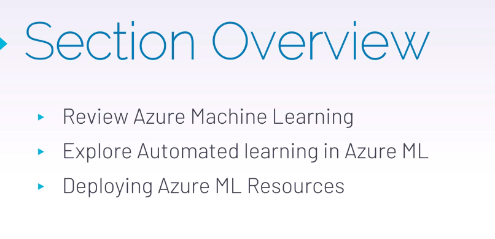
- Azure ML is a cloud-based service that streamlines the ML process, allowing users to focus on building and deploying intelligent applications.
- 
- 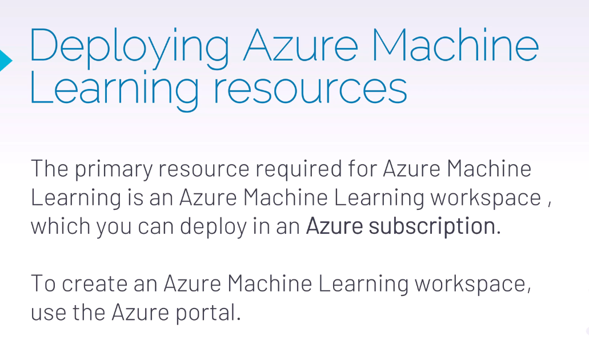
- 
- 
- 
- 
- 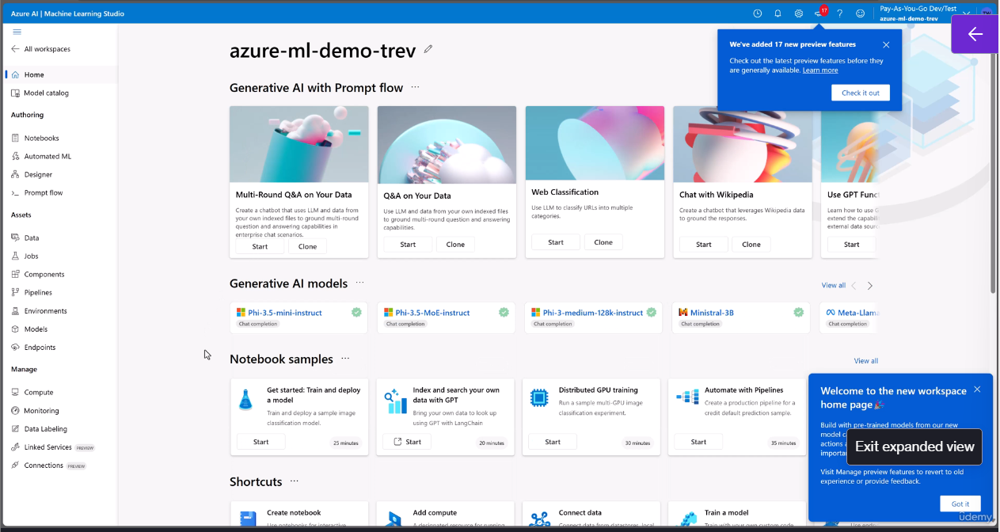
- 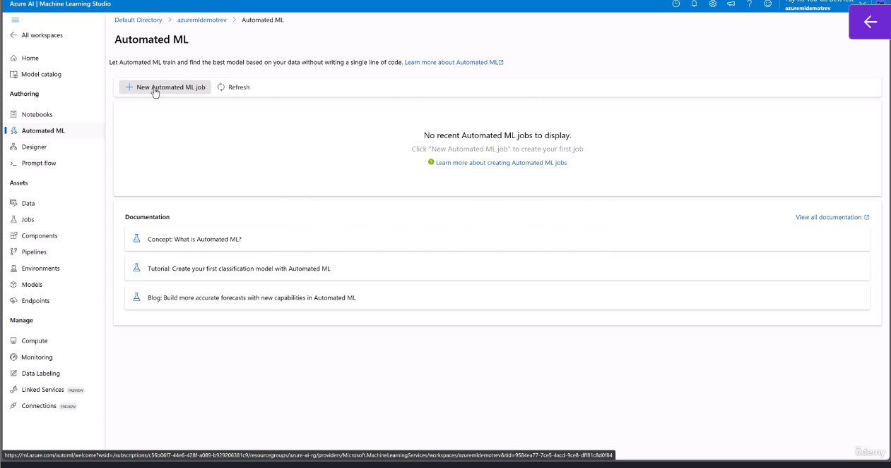
- 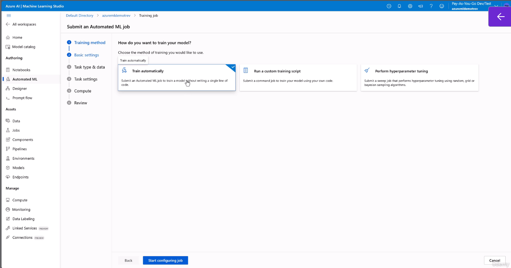
- 
- 
- 
- Here rentals is our label(output) and the rest are features(input)
- 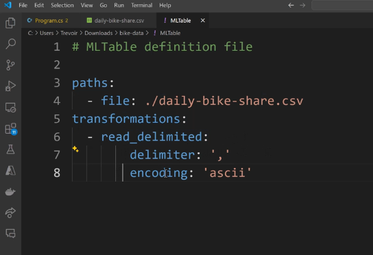
- 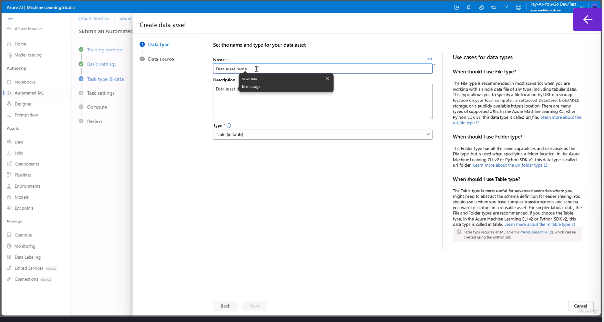
- 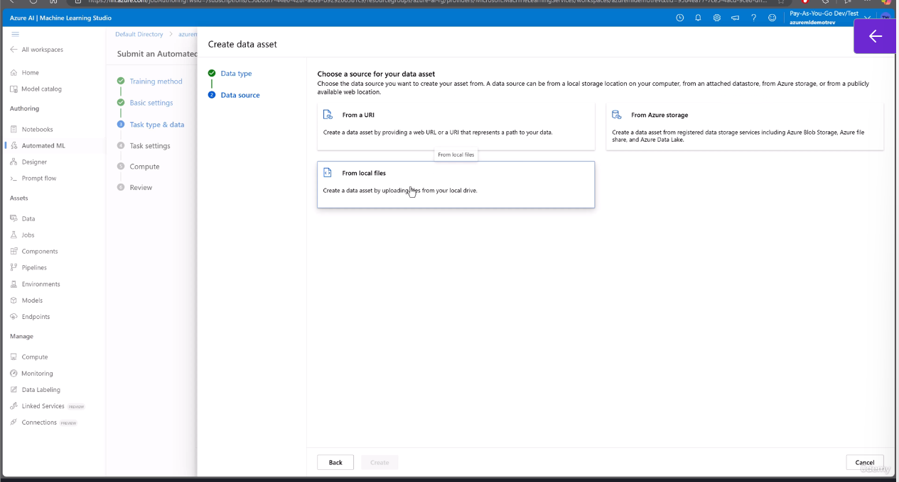
- 
- 
- An ML Table file is a specific data format used in Azure Machine Learning (Azure ML) to represent tabular data in a way that’s optimized for machine learning workflows. It’s not a widely recognized standalone file type outside Azure ML but is part of its ecosystem to streamline data handling, especially for tasks like training models (e.g., your earlier question about transformers for image labeling) or running data pipelines.
- It consists of:
- A schema file: Typically a YAML file (e.g., mltable.yaml) that defines the structure, data types, and location of the underlying data.
- Underlying data: The actual tabular data, which can be stored in formats like CSV, Parquet, or Delta, and hosted in places like Azure Blob Storage, Data Lake, or even local storage.
- 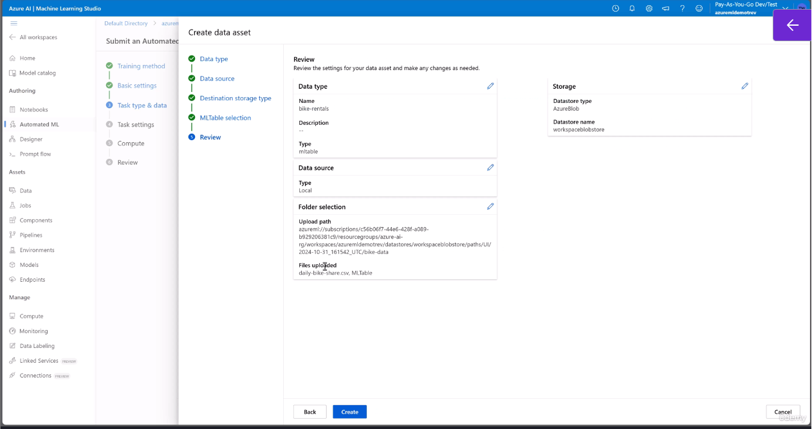
- 
- 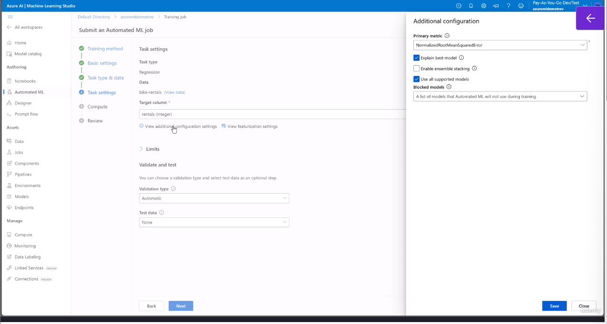
- 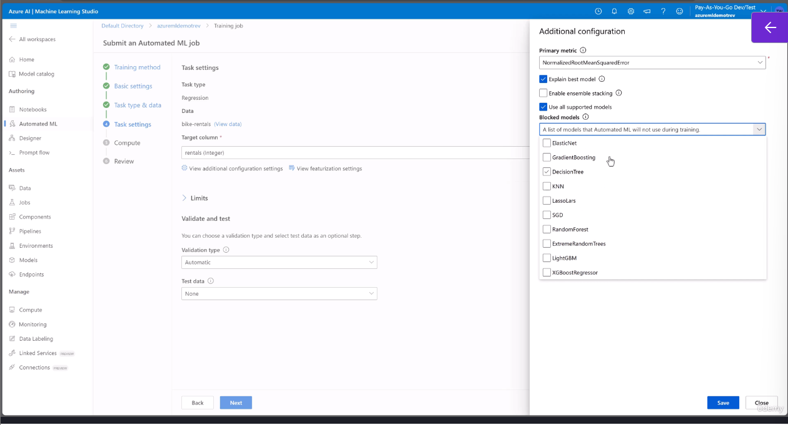
- 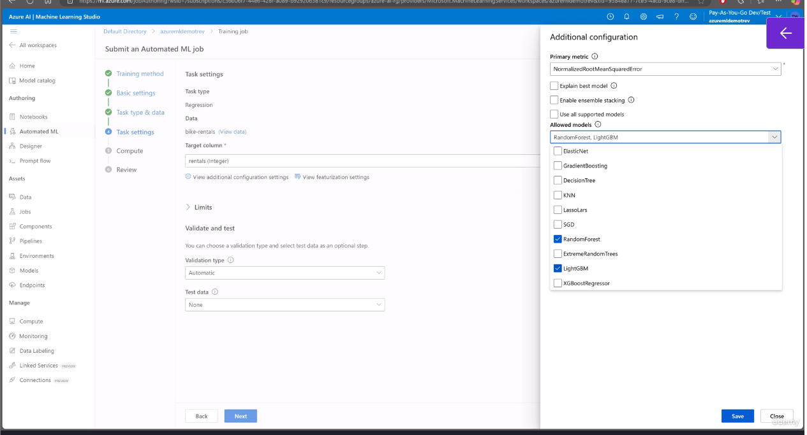
- Random Forest is a commonly used machine learning algorithm that combines the output of multiple decision trees to reach a single result.
- LightGBM also uses decision tree based algorithms, and it basically does ranking and classification for other for machine learning tasks.
- 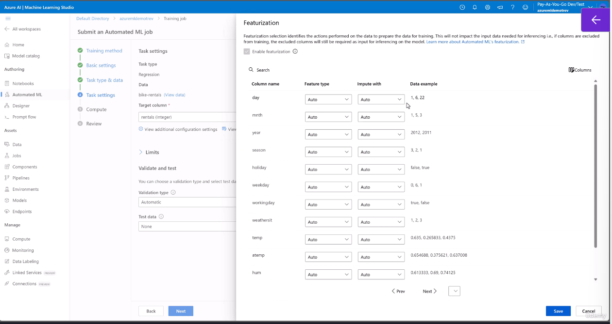
- 
- 
- 
- 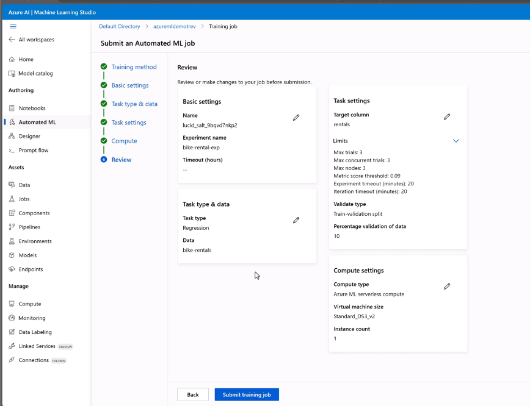
- 
- 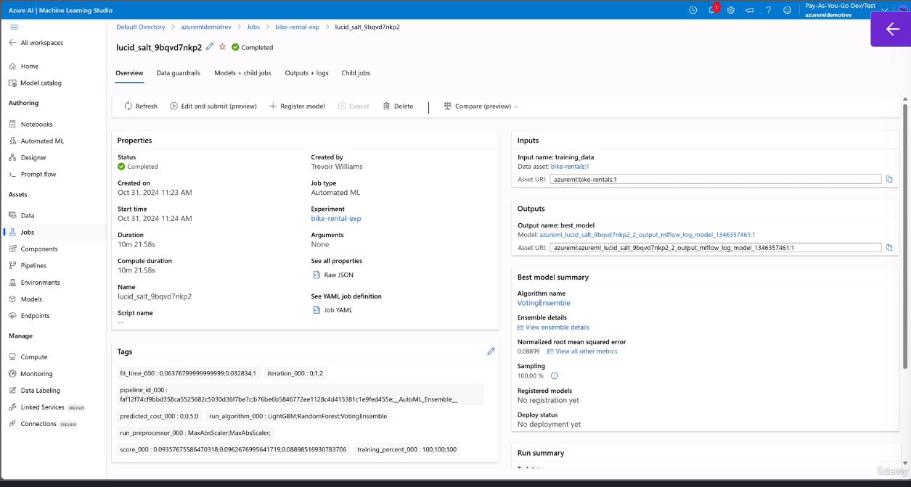
- 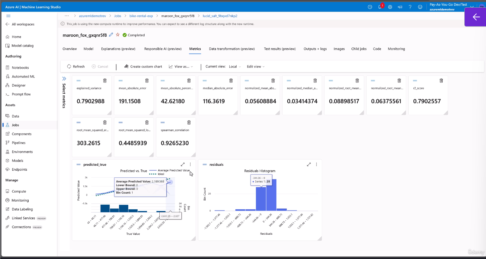
- 
- Deploy to a real-time endpoint
- 
- 
- 
- 

## Test endpoint in Console App
- 
- 
- 
- 
- 

## Creating GenAI Solutions using .NET and Azure OpenAI
- 
- 
- 
- 
- 
- 
- 
- Azure AI Foundry is used for Azure Cognitive Services also
- 
- 
- 
- 
- 
- 
- Each prompt is appended with a particular system message to provide context for model responses and sets some context as to how the model should interact and respond.
- 
- 
- 
- 
- 
- 
- 
- 
- It will launch as an Azure Web Application
- 
- 
- We need to modify the application logic to add our own context and we can customize our chatbot as per our needs.
- 
- 

### Prompt Engineering
- 
- 
- 
- 
- 
- 
- 
- 
- 
- Install the nuget package Azure.AI.OpenAI
- This application will now interact with our deployed chatgpt model on Azure AI Foundry.
```c#
//Create a Chatbot to interact with the deployed model

using System;
using System.Threading.Tasks;
using Azure;
using Azure.AI.OpenAI;
using OpenAI.Chat;


class Program
{
    static async Task Main()
    {
        // Configure Azure OpenAI details
        string endpoint = "https://YOUR_AZURE_OPENAI_ENDPOINT.openai.azure.com/";
        string apiKey = "YOUR_AZURE_OPENAI_API_KEY";
        string deploymentName = "gpt-35-turbo-16k";  // Example: "gpt-4-turbo"

        AzureKeyCredential credential = new AzureKeyCredential(apiKey);
        // Create OpenAI client
        AzureOpenAIClient azureClient = new (new Uri(endpoint), credential);
        ChatClient chatClient = azureClient.GetChatClient(deploymentName);
        string systemMessage = "You are a senior developer with 10 years of .NET development experience. Have a good sense of humor";

        Console.WriteLine("Azure OpenAI ChatBot - Type 'exit' to quit.");
        while (true)
        {
            Console.Write("You: ");
            string userInput = Console.ReadLine();

            if (string.IsNullOrWhiteSpace(userInput) || userInput.ToLower() == "exit")
                break;

            // Send user input to Azure Open AI
            ChatCompletion completion = await chatClient.CompleteChatAsync(
                new SystemChatMessage(systemMessage),
                new UserChatMessage("Hi, can you help me"),
                new AssistantChatMessage("Yes, of course how can i mentor you today"),
                new UserChatMessage(userInput)
                );

            //Output the response content
            Console.WriteLine($"AI: {completion.Content[0].Text}\n");
        }
    }
}

```

### Code Generation
- 
- 
- 
- 
- 
- 

### DALL-E Model
- 
- 
- 
- 
- 
- 
- 
```html
@page
@model IndexModel
@{
    ViewData["Title"] = "DALL E Web Demo";
}

<div class="text-center">
    <h1 class="display-4">DALL E Web Demo</h1>
    <p>Learn how to generatem images in your web app using DALL-E</a>.</p>
</div>
<div class="row">
    <div class="col-6">

    <form method="post">
            <div class="form-group">
                <label asp-for="Prompt" class="control-label"></label>
                <input asp-for="Prompt" class="form-control"></input>
                <span asp-validation-for="Prompt" class="text-danger"></span>
                </div>
               <button type="submit" class="btn btn-primary">Generate Image</button>

    </form>
    </div>
    <div class="col-6">
        <p>Original Prompt: @Model.Prompt</p>
        <p>Revised Prompt: @Model.RevisedPrompt</p>
        <hr/>
        
    </div>
    </div>


```
- Code behind would be:
```c#
using Azure;
using Azure.AI.OpenAI;
using Microsoft.AspNetCore.Mvc;
using Microsoft.AspNetCore.Mvc.RazorPages;
using OpenAI.Images;

namespace DallEWebApp.Pages
{
    public class IndexModel : PageModel
    {
        private readonly ILogger<IndexModel> _logger;

        [BindProperty]
        public string Prompt { get; set; }
        public string ImageUrl { get; set; }

        public string RevisedPrompt { get; set; }

        public IndexModel(ILogger<IndexModel> logger)
        {
            _logger = logger;
        }

        public void OnGet()
        {

        }

        public async Task<IActionResult> OnPostAsync()
        {
            string endpoint = "";
            string apiKey = "";
            AzureOpenAIClient azureClient = new(new Uri(endpoint), new AzureKeyCredential(apiKey));
            ImageClient imageClient = azureClient.GetImageClient("deployment-name ");//Name of the deployed DALL-E model

            var imageGenerationResult = await imageClient.GenerateImageAsync(Prompt,
                new ImageGenerationOptions
                {
                    Size = GeneratedImageSize.W1024xH1024

                });

            ImageUrl = imageGenerationResult.Value.ImageUri.ToString();
            RevisedPrompt = imageGenerationResult.Value.RevisedPrompt;

            return Page();
        }
    }
}


```
- 

## Understanding Retrieval Augment Generation(RAG)
- 
- 

### Retrieval Augmentation Generation(RAG) with AI Studio
- 
- 
- Create a Storage Account also to store the actual data
- 
- Upload some ebooks to the blob container
- 
- Deploy a model called text-embedding-ada-002
- 
- 
- Now we have 2 models deployed gpt-35-turbo and text-embedding-ada-002
- Now we will create an AI Search Index
- Go to the Azure AI Search Service
- Select Import and Vectorize Data
- 
- Choose the Azure Blob Storage
- 
- Select the Model as text-embedding-ada-002 to do the vectorization
- 
- Enable Semantic Ranking
- 
- 
- We can then start searching
- 
- It is looking through blocks of text trying to find the memory leak
- We will go back to our model gpt-35-turbo that we deployed earlier.
- Now to perform RAG, we need to provide it a datasource so that we can ask questions on our own data.
- 
- 
- 
- 
- 
- Now we have a datasource associated with our already deployed model.
- Now we update the context for the model
- 
- 
- 
- Now it gives citations also to the ebooks we uploaded.
- 
- 
- So in a matter of few clicks we have setup an entire RAG model, this model vectorizes ebooks and stores them in Azure AI Search. This is fed as data source to our earlier deployed gpt-35-turbo model and in addition to the knowledge capabilities of gpt-35-turbo we have now augmented its results with the text found in the ebooks we uploaded.
- Now we will create a console app that interacts with this RAG model
- First find the endpoint of azure ai search
- 
- Then go to Indexes and copy the index value
- 
- Now get the admin keys
- 
- We can make a console app like this to interact with this RAG Model
```c#
using Azure;
using Azure.AI.OpenAI;
using Azure.AI.OpenAI.Chat;
using OpenAI.Chat;

# pragma warning disable AOAI001

string endpoint = "";
string key = "";
string azureSearchEndpoint = "https://ai-search-nishant.search.windows.net";
string azureSearchKey = "";
string azureSearchIndex = "azuresearchindex";

AzureKeyCredential credential = new AzureKeyCredential(key);
AzureOpenAIClient azureClient = new AzureOpenAIClient(new Uri(endpoint), credential);
ChatClient chatClient = azureClient.GetChatClient("gpt-35-turbo-16k");

ChatCompletionOptions chatOptions = new();

//Configure the data source that we will use to answer the question
//In this case, we are using Azure Search as the data source
//Note that this helps to us to do Retrieval Augmented Generation (RAG) using Azure Search
chatOptions.AddDataSource(new AzureSearchChatDataSource()
{
    Endpoint = new Uri(azureSearchEndpoint),
    IndexName = azureSearchIndex,
    Authentication = DataSourceAuthentication.FromApiKey(azureSearchKey),
});

Console.WriteLine("Enter your question(type 'quit' to exit): ");
string userPrompt = Console.ReadLine() ?? string.Empty;

ChatCompletion completion = await chatClient.CompleteChatAsync(
    //Collection of User Chat Messages
    [
    new UserChatMessage(userPrompt)
    ],
    chatOptions);

ChatMessageContext chatContext = completion.GetMessageContext();
if(chatContext?.Intent is not null)
{
    Console.WriteLine($"Intent: {chatContext.Intent}");
}

//This is effective used to provide reference of the ebooks we had uploaded and vectorized earlier
foreach(ChatCitation citation in chatContext?.Citations ?? Enumerable.Empty<ChatCitation>())
{
    
    Console.WriteLine($"Citation: {citation.Content}");
    Console.WriteLine($"Citation URL: {citation.Url}");
}

```
- 


## Review of the Course
- 
- 
- 
- 
- 
- 

## Microsoft Official Training Materials for AI-900
- Generative AI is a branch of AI that enables software applications to generate new content; often natural language dialogs, but also images, video, code, and other formats.
- Generative AI models encapsulate semantic relationships between language elements (that's a fancy way of saying that the models "know" how words relate to one another), and that's what enables them to generate a meaningful sequence of text.
- here are large language models (LLMs) and small language models (SLMs) - the difference is based on the volume of data and the number of variables in the model. LLMs are very powerful and generalize well, but can be more costly to train and use. SLMs tend to work well in scenarios that are more focused on specific topic areas, and usually cost less.
- Common uses of generative AI include:
- Implementing chatbots and AI agents that assist human users.
- Creating new documents or other content (often as a starting point   for further iterative development)
- Automated translation of text between languages.
- Summarizing or explaining complex documents.


### Computer Vision
- Computer vision is accomplished by using large numbers of images to train a model.
- Image classification is a form of computer vision in which a model is trained with images that are labeled with the main subject of the image (in other words, what it's an image of) so that it can analyze unlabeled images and predict the most appropriate label - identifying the subject of the image.
- Object detection is a form of computer vision in which the model is trained to identify the location of specific objects in an image.
- There are more advanced forms of computer vision - for example, semantic segmentation is an advanced form of object detection where, rather than indicate an object's location by drawing a box around it, the model can identify the individual pixels in the image that belong to a particular object.
- You can combine computer vision and language models to create a multi-modal model that combines computer vision and generative AI capabilities.
- Common uses of computer vision include:
- Auto-captioning or tag-generation for photographs.
- Visual search.
- Monitoring stock levels or identifying items for checkout in retail scenarios.
- Security video monitoring.
- Authentication through facial recognition.
- Robotics and self-driving vehicles.

### Speech Recognition
- Speech recognition is the ability of AI to "hear" and interpret speech. Usually this capability takes the form of speech-to-text (where the audio signal for the speech is transcribed into text).
- Speech synthesis is the ability of AI to vocalize words as spoken language. Usually this capability takes the form of text-to-speech in which information in text format is converted into an audible signal.
- AI speech technology is evolving rapidly to handle challenges like ignoring background noise, detecting interruptions, and generating increasingly expressive and human-like voices.
- Common uses of AI speech technologies include:
- Personal AI assistants in phones, computers, or household devices with which you interact by talking.
- Automated transcription of calls or meetings.
- Automating audio descriptions of video or text.
- Automated speech translation between languages.

### Natural Language Processing
- NLP capabilities are based on models that are trained to do particular types of text analysis.
- While many natural language processing scenarios are handled by generative AI models today, there are many common text analytics use cases where simpler NLP language models can be more cost-effective.
- Entity extraction - identifying mentions of entities like people, places, organizations in a document
- Text classification - assigning document to a specific category.
- Sentiment analysis - determining whether a body of text is positive, negative, or neutral and inferring opinions.
- Language detection - identifying the language in which text is written.
- Common uses of NLP technologies include:
- Analyzing document or transcripts of calls and meetings to determine key subjects and identify specific mentions of people, places, organizations, products, or other entities.
- Analyzing social media posts, product reviews, or articles to evaluate sentiment and opinion.
- Implementing chatbots that can answer frequently asked questions or orchestrate predictable conversational dialogs that don't require the complexity of generative AI.
- The basis for most document analysis solutions is a computer vision technology called optical character recognition (OCR).
- While an OCR model can identify the location of text in an image, more advanced models can also interpret individual values in the document - and so extract specific fields.
- While most data extraction models have historically focused on extracting fields from text-based forms, more advanced models that can extract information from audio recording, images, and videos are becoming more readily available.
- Common uses of AI to extract data and insights include:
- Automated processing of forms and other documents in a business process - for example, processing an expense claim.
- Indexing documents for search.
- Identifying key points and follow-up actions from meeting transcripts or recordings.

### Responsible AI
- Fairness: AI models are trained using data, which is generally sourced and selected by humans. There's substantial risk that the data selection criteria, or the data itself reflects unconscious bias that may cause a model to produce discriminatory outputs. AI developers need to take care to minimize bias in training data and test AI systems for fairness.
- An AI-powered college admissions system should be tested to ensure it evaluates all applications fairly, taking into account relevant academic criteria but avoiding unfounded discrimination based on irrelevant demographic factors.
- A facial identification system used in an airport or other secure area should delete personal images that are used for temporary access as soon as they're no longer required. Additionally, safeguards should prevent the images being made accessible to operators or users who have no need to view them.
- A web-based chatbot that offers speech-based interaction should also generate text captions to avoid making the system unusable for users with a hearing impairment.


## Machine Learning
- Machine learning has its origins in statistics and mathematical modeling of data.
- Because machine learning is based on mathematics and statistics, it's common to think about machine learning models in mathematical terms. Fundamentally, a machine learning model is a software application that encapsulates a function to calculate an output value based on one or more input values. The process of defining that function is known as training. After the function has been defined, you can use it to predict new values in a process called inferencing.
- In mathematical terms, you'll often see the features referred to using the shorthand variable name x, and the label referred to as y. Usually, an observation consists of multiple feature values, so x is actually a vector (an array with multiple values), like this: [x1,x2,x3,...].
- An algorithm is applied to the data to try to determine a relationship between the features and the label, and generalize that relationship as a calculation that can be performed on x to calculate y. The specific algorithm used depends on the kind of predictive problem you're trying to solve (more about this later), but the basic principle is to try to fit the data to a function in which the values of the features can be used to calculate the label.
- The result of the algorithm is a model that encapsulates the calculation derived by the algorithm as a function - let's call it f. In mathematical notation:
y = f(x)
- Now that the training phase is complete, the trained model can be used for inferencing. The model is essentially a software program that encapsulates the function produced by the training process. You can input a set of feature values, and receive as an output a prediction of the corresponding label. Because the output from the model is a prediction that was calculated by the function, and not an observed value, you'll often see the output from the function shown as ŷ (which is rather delightfully verbalized as "y-hat").

### Types of Machine Learning
- 
- Supervised machine learning is a general term for machine learning algorithms in which the training data includes both feature values and known label values. Supervised machine learning is used to train models by determining a relationship between the features and labels in past observations, so that unknown labels can be predicted for features in future cases.
- Regression is a form of supervised machine learning in which the label predicted by the model is a numeric value. For example:
- The number of ice creams sold on a given day, based on the temperature, rainfall, and windspeed.
- The selling price of a property based on its size in square feet, the number of bedrooms it contains, and socio-economic metrics for its location.
- The fuel efficiency (in miles-per-gallon) of a car based on its engine size, weight, width, height, and length.
- Classification is a form of supervised machine learning in which the label represents a categorization, or class. There are two common classification scenarios.
#### Binary classification
In binary classification, the label determines whether the observed item is (or isn't) an instance of a specific class. Or put another way, binary classification models predict one of two mutually exclusive outcomes. 
- Whether a patient is at risk for diabetes based on clinical metrics like weight, age, blood glucose level, and so on.
- Whether a bank customer will default on a loan based on income, credit history, age, and other factors.
- In all of these examples, the model predicts a binary true/false or positive/negative prediction for a single possible class.

#### Multiclass classification
- Multiclass classification extends binary classification to predict a label that represents one of multiple possible classes. For example,
- The species of a penguin (Adelie, Gentoo, or Chinstrap) based on its physical measurements.
- The genre of a movie (comedy, horror, romance, adventure, or science fiction) based on its cast, director, and budget.
- In most scenarios that involve a known set of multiple classes, multiclass classification is used to predict mutually exclusive labels. For example, a penguin can't be both a Gentoo and an Adelie. However, there are also some algorithms that you can use to train multilabel classification models, in which there may be more than one valid label for a single observation. For example, a movie could potentially be categorized as both science fiction and comedy.

### Unsupervised machine learning
- Unsupervised machine learning involves training models using data that consists only of feature values without any known labels. Unsupervised machine learning algorithms determine relationships between the features of the observations in the training data.

#### Clustering
- The most common form of unsupervised machine learning is clustering. A clustering algorithm identifies similarities between observations based on their features, and groups them into discrete clusters. For example:

- Group similar flowers based on their size, number of leaves, and number of petals.
- Identify groups of similar customers based on demographic attributes and purchasing behavior.
- In some ways, clustering is similar to multiclass classification; in that it categorizes observations into discrete groups. The difference is that when using classification, you already know the classes to which the observations in the training data belong; so the algorithm works by determining the relationship between the features and the known classification label. In clustering, there's no previously known cluster label and the algorithm groups the data observations based purely on similarity of features.

- In some cases, clustering is used to determine the set of classes that exist before training a classification model. For example, you might use clustering to segment your customers into groups, and then analyze those groups to identify and categorize different classes of customer (high value - low volume, frequent small purchaser, and so on). You could then use your categorizations to label the observations in your clustering results and use the labeled data to train a classification model that predicts to which customer category a new customer might belong.

### Regression
- Regression models are trained to predict numeric label values based on training data that includes both features and known labels. The process for training a regression model (or indeed, any supervised machine learning model) involves multiple iterations in which you use an appropriate algorithm (usually with some parameterized settings) to train a model, evaluate the model's predictive performance, and refine the model by repeating the training process with different algorithms and parameters until you achieve an acceptable level of predictive accuracy.
- Split the training data (randomly) to create a dataset with which to train the model while holding back a subset of the data that you'll use to validate the trained model.
- Use an algorithm to fit the training data to a model. In the case of a regression model, use a regression algorithm such as linear regression.
- Use the validation data you held back to test the model by predicting labels for the features.
- Compare the known actual labels in the validation dataset to the labels that the model predicted. Then aggregate the differences between the predicted and actual label values to calculate a metric that indicates how accurately the model predicted for the validation data.
- we're ready to apply an algorithm to our training data and fit it to a function that applies an operation to x to calculate y. One such algorithm is linear regression, which works by deriving a function that produces a straight line through the intersections of the x and y values while minimizing the average distance between the line and the plotted points, like this:
- 

### Regression Value Metrics

#### Mean Absolute Error (MAE)
The variance in this example indicates by how many ice creams each prediction was wrong. It doesn't matter if the prediction was over or under the actual value (so for example, -3 and +3 both indicate a variance of 3). This metric is known as the absolute error for each prediction, and can be summarized for the whole validation set as the mean absolute error (MAE).

In the ice cream example, the mean (average) of the absolute errors (2, 3, 3, 1, 2, and 3) is 2.33.

#### Mean Squared Error (MSE)
The mean absolute error metric takes all discrepancies between predicted and actual labels into account equally. However, it may be more desirable to have a model that is consistently wrong by a small amount than one that makes fewer, but larger errors. One way to produce a metric that "amplifies" larger errors by squaring the individual errors and calculating the mean of the squared values. This metric is known as the mean squared error (MSE).

In our ice cream example, the mean of the squared absolute values (which are 4, 9, 9, 1, 4, and 9) is 6.

#### Root Mean Squared Error (RMSE)
The mean squared error helps take the magnitude of errors into account, but because it squares the error values, the resulting metric no longer represents the quantity measured by the label. In other words, we can say that the MSE of our model is 6, but that doesn't measure its accuracy in terms of the number of ice creams that were mispredicted; 6 is just a numeric score that indicates the level of error in the validation predictions.

If we want to measure the error in terms of the number of ice creams, we need to calculate the square root of the MSE; which produces a metric called, unsurprisingly, Root Mean Squared Error. In this case √6, which is 2.45 (ice creams).

#### Coefficient of determination (R^2)
- All of the metrics so far compare the discrepancy between the predicted and actual values in order to evaluate the model. However, in reality, there's some natural random variance in the daily sales of ice cream that the model takes into account. In a linear regression model, the training algorithm fits a straight line that minimizes the mean variance between the function and the known label values. The coefficient of determination (more commonly referred to as R2 or R-Squared) is a metric that measures the proportion of variance in the validation results that can be explained by the model, as opposed to some anomalous aspect of the validation data (for example, a day with a highly unusual number of ice creams sales because of a local festival).
- 
- The metrics described above are commonly used to evaluate a regression model. In most real-world scenarios, a data scientist will use an iterative process to repeatedly train and evaluate a model, varying:
- Feature selection and preparation (choosing which features to include in the model, and calculations applied to them to help ensure a better fit).
- Algorithm selection (We explored linear regression in the previous example, but there are many other regression algorithms)
- Algorithm parameters (numeric settings to control algorithm behavior, more accurately called hyperparameters to differentiate them from the x and y parameters).

### Binary Classification
- Classification, like regression, is a supervised machine learning technique; and therefore follows the same iterative process of training, validating, and evaluating models. Instead of calculating numeric values like a regression model, the algorithms used to train classification models calculate probability values for class assignment and the evaluation metrics used to assess model performance compare the predicted classes to the actual classes.
- Binary classification algorithms are used to train a model that predicts one of two possible labels for a single class. Essentially, predicting true or false. In most real scenarios, the data observations used to train and validate the model consist of multiple feature (x) values and a y value that is either 1 or 0.
- To understand how binary classification works, let's look at a simplified example that uses a single feature (x) to predict whether the label y is 1 or 0. In this example, we'll use the blood glucose level of a patient to predict whether or not the patient has diabetes. Here's the data with which we'll train the model:
- 
- To train the model, we'll use an algorithm to fit the training data to a function that calculates the probability of the class label being true (in other words, that the patient has diabetes). Probability is measured as a value between 0.0 and 1.0, such that the total probability for all possible classes is 1.0. So for example, if the probability of a patient having diabetes is 0.7, then there's a corresponding probability of 0.3 that the patient isn't diabetic.

- There are many algorithms that can be used for binary classification, such as logistic regression, which derives a sigmoid (S-shaped) function with values between 0.0 and 1.0, like this:
- 
- Despite its name, in machine learning logistic regression is used for classification, not regression. The important point is the logistic nature of the function it produces, which describes an S-shaped curve between a lower and upper value (0.0 and 1.0 when used for binary classification).
- The function produced by the algorithm describes the probability of y being true (y=1) for a given value of x. Mathematically, you can express the function like this:

f(x) = P(y=1 | x)
- As with regression, when training a binary classification model you hold back a random subset of data with which to validate the trained model. 
- Based on whether the probability calculated by the function is above or below the threshold, the model generates a predicted label of 1 or 0 for each observation. We can then compare the predicted class labels (ŷ) to the actual class labels (y), as shown here:
- 
- The first step in calculating evaluation metrics for a binary classification model is usually to create a matrix of the number of correct and incorrect predictions for each possible class label:
- 
- The arrangement of the confusion matrix is such that correct (true) predictions are shown in a diagonal line from top-left to bottom-right. Often, color-intensity is used to indicate the number of predictions in each cell, so a quick glance at a model that predicts well should reveal a deeply shaded diagonal trend.

#### Accuracy: 
- The simplest metric you can calculate from the confusion matrix is accuracy - the proportion of predictions that the model got right. Accuracy is calculated as:

(TN+TP) ÷ (TN+FN+FP+TP)

In the case of our diabetes example, the calculation is:

(2+3) ÷ (2+1+0+3)

= 5 ÷ 6

= 0.83

So for our validation data, the diabetes classification model produced correct predictions 83% of the time.
- Accuracy might initially seem like a good metric to evaluate a model, but consider this. Suppose 11% of the population has diabetes. You could create a model that always predicts 0, and it would achieve an accuracy of 89%, even though it makes no real attempt to differentiate between patients by evaluating their features. What we really need is a deeper understanding of how the model performs at predicting 1 for positive cases and 0 for negative cases.

#### Recall
- Recall is a metric that measures the proportion of positive cases that the model identified correctly. In other words, compared to the number of patients who have diabetes, how many did the model predict to have diabetes?
- The formula for recall is:

TP ÷ (TP+FN)

For our diabetes example:

3 ÷ (3+1)

= 3 ÷ 4

= 0.75

So our model correctly identified 75% of patients who have diabetes as having diabetes.

#### Precision
- Precision is a similar metric to recall, but measures the proportion of predicted positive cases where the true label is actually positive. In other words, what proportion of the patients predicted by the model to have diabetes actually have diabetes?
- The formula for precision is:

TP ÷ (TP+FP)

For our diabetes example:

3 ÷ (3+0)

= 3 ÷ 3

= 1.0

So 100% of the patients predicted by our model to have diabetes do in fact have diabetes.

#### F1 Score
- F1-score is an overall metric that combined recall and precision. The formula for F1-score is:

(2 x Precision x Recall) ÷ (Precision + Recall)

For our diabetes example:

(2 x 1.0 x 0.75) ÷ (1.0 + 0.75)

= 1.5 ÷ 1.75

= 0.86

#### Area Under the Curve(AUC)
- Another name for recall is the true positive rate (TPR), and there's an equivalent metric called the false positive rate (FPR) that is calculated as FP÷(FP+TN). We already know that the TPR for our model when using a threshold of 0.5 is 0.75, and we can use the formula for FPR to calculate a value of 0÷2 = 0.
- Of course, if we were to change the threshold above which the model predicts true (1), it would affect the number of positive and negative predictions; and therefore change the TPR and FPR metrics. These metrics are often used to evaluate a model by plotting a received operator characteristic (ROC) curve that compares the TPR and FPR for every possible threshold value between 0.0 and 1.0:
- 
- The ROC curve for a perfect model would go straight up the TPR axis on the left and then across the FPR axis at the top. Since the plot area for the curve measures 1x1, the area under this perfect curve would be 1.0 (meaning that the model is correct 100% of the time). In contrast, a diagonal line from the bottom-left to the top-right represents the results that would be achieved by randomly guessing a binary label; producing an area under the curve of 0.5. In other words, given two possible class labels, you could reasonably expect to guess correctly 50% of the time.
- In the case of our diabetes model, the curve above is produced, and the area under the curve (AUC) metric is 0.875. Since the AUC is higher than 0.5, we can conclude the model performs better at predicting whether or not a patient has diabetes than randomly guessing.


### Multiclass Classification
- Multiclass classification is used to predict to which of multiple possible classes an observation belongs. As a supervised machine learning technique, it follows the same iterative train, validate, and evaluate process as regression and binary classification in which a subset of the training data is held back to validate the trained model.
- Multiclass classification algorithms are used to calculate probability values for multiple class labels, enabling a model to predict the most probable class for a given observation.
- Let's explore an example in which we have some observations of penguins, in which the flipper length (x) of each penguin is recorded. For each observation, the data includes the penguin species (y), which is encoded as follows:

0: Adelie
1: Gentoo
2: Chinstrap
- As with previous examples in this module, a real scenario would include multiple feature (x) values. We'll use a single feature to keep things simple.
- 
- To train a multiclass classification model, we need to use an algorithm to fit the training data to a function that calculates a probability value for each possible class. There are two kinds of algorithm you can use to do this:

- One-vs-Rest (OvR) algorithms
- Multinomial algorithms

### One-vs-Rest Algorithms
- One-vs-Rest algorithms train a binary classification function for each class, each calculating the probability that the observation is an example of the target class. Each function calculates the probability of the observation being a specific class compared to any other class. For our penguin species classification model, the algorithm would essentially create three binary classification functions:

f^0(x) = P(y=0 | x)
f^1(x) = P(y=1 | x)
f^2(x) = P(y=2 | x)

- Each algorithm produces a sigmoid function that calculates a probability value between 0.0 and 1.0. A model trained using this kind of algorithm predicts the class for the function that produces the highest probability output.

### Multinomial Algorithm
- As an alternative approach is to use a multinomial algorithm, which creates a single function that returns a multi-valued output. The output is a vector (an array of values) that contains the probability distribution for all possible classes - with a probability score for each class which when totaled add up to 1.0:

f(x) =[P(y=0|x), P(y=1|x), P(y=2|x)]

- An example of this kind of function is a softmax function, which could produce an output like the following example:

[0.2, 0.3, 0.5]

- The elements in the vector represent the probabilities for classes 0, 1, and 2 respectively; so in this case, the class with the highest probability is 2.
- Regardless of which type of algorithm is used, the model uses the resulting function to determine the most probable class for a given set of features (x) and predicts the corresponding class label (y).


### Evaluating a multiclass classification model
- You can evaluate a multiclass classifier by calculating binary classification metrics for each individual class. Alternatively, you can calculate aggregate metrics that take all classes into account.
- Let's assume that we've validated our multiclass classifier, and obtained the following results:
- 
- The confusion matrix for a multiclass classifier is similar to that of a binary classifier, except that it shows the number of predictions for each combination of predicted (ŷ) and actual class labels (y):
- 
- From this confusion matrix, we can determine the metrics for each individual class as follows:
- 

### Clustering
- Clustering is a form of unsupervised machine learning in which observations are grouped into clusters based on similarities in their data values, or features. This kind of machine learning is considered unsupervised because it doesn't make use of previously known label values to train a model. In a clustering model, the label is the cluster to which the observation is assigned, based only on its features.
- For example, suppose a botanist observes a sample of flowers and records the number of leaves and petals on each flower:
- 
- There are no known labels in the dataset, just two features. The goal is not to identify the different types (species) of flower; just to group similar flowers together based on the number of leaves and petals.
- 
- There are multiple algorithms you can use for clustering. One of the most commonly used algorithms is K-Means clustering, which consists of the following steps:

- The feature (x) values are vectorized to define n-dimensional coordinates (where n is the number of features). In the flower example, we have two features: number of leaves (x1) and number of petals (x2). So, the feature vector has two coordinates that we can use to conceptually plot the data points in two-dimensional space ([x1,x2])
- You decide how many clusters you want to use to group the flowers - call this value k. For example, to create three clusters, you would use a k value of 3. Then k points are plotted at random coordinates. These points become the center points for each cluster, so they're called centroids.
- Each data point (in this case a flower) is assigned to its nearest centroid.
- Each centroid is moved to the center of the data points assigned to it based on the mean distance between the points.
- After the centroid is moved, the data points may now be closer to a different centroid, so the data points are reassigned to clusters based on the new closest centroid.
- The centroid movement and cluster reallocation steps are repeated until the clusters become stable or a predetermined maximum number of iterations is reached.
- Since there's no known label with which to compare the predicted cluster assignments, evaluation of a clustering model is based on how well the resulting clusters are separated from one another.
- 

## Deep Learning
- Deep learning is an advanced form of machine learning that tries to emulate the way the human brain learns. The key to deep learning is the creation of an artificial neural network that simulates electrochemical activity in biological neurons by using mathematical functions
- Each neuron is a function that operates on an input value (x) and a weight (w). The function is wrapped in an activation function that determines whether to pass the output on.
- Artificial neural networks are made up of multiple layers of neurons - essentially defining a deeply nested function. This architecture is the reason the technique is referred to as deep learning and the models produced by it are often referred to as deep neural networks (DNNs).
- You can use deep neural networks for many kinds of machine learning problem, including regression and classification, as well as more specialized models for natural language processing and computer vision.
- deep learning involves fitting training data to a function that can predict a label (y) based on the value of one or more features (x). 
- The function (f(x)) is the outer layer of a nested function in which each layer of the neural network encapsulates functions that operate on x and the weight (w) values associated with them. The algorithm used to train the model involves iteratively feeding the feature values (x) in the training data forward through the layers to calculate output values for ŷ, validating the model to evaluate how far off the calculated ŷ values are from the known y values (which quantifies the level of error, or loss, in the model), and then modifying the weights (w) to reduce the loss.
- The trained model includes the final weight values that result in the most accurate predictions.
- To better understand how a deep neural network model works, let's explore an example in which a neural network is used to define a classification model for penguin species.
- 
- The feature data (x) consists of some measurements of a penguin. Specifically, the measurements are:

The length of the penguin's bill.
The depth of the penguin's bill.
The length of the penguin's flippers.
The penguin's weight.
- In this case, x is a vector of four values, or mathematically, x=[x1,x2,x3,x4].
- The label we're trying to predict (y) is the species of the penguin, and that there are three possible species it could be:

Adelie
Gentoo
Chinstrap
- This is an example of a classification problem, in which the machine learning model must predict the most probable class to which an observation belongs. A classification model accomplishes this by predicting a label that consists of the probability for each class. In other words, y is a vector of three probability values; one for each of the possible classes: [P(y=0|x), P(y=1|x), P(y=2|x)].
- The process for inferencing a predicted penguin class using this network is:
- The feature vector for a penguin observation is fed into the input layer of the neural network, which consists of a neuron for each x value. In this example, the following x vector is used as the input: [37.3, 16.8, 19.2, 30.0]
- The functions for the first layer of neurons each calculate a weighted sum by combining the x value and w weight, and pass it to an activation function that determines if it meets the threshold to be passed on to the next layer.
- ach neuron in a layer is connected to all of the neurons in the next layer (an architecture sometimes called a fully connected network) so the results of each layer are fed forward through the network until they reach the output layer.
- The output layer produces a vector of values; in this case, using a softmax or similar function to calculate the probability distribution for the three possible classes of penguin. In this example, the output vector is: [0.2, 0.7, 0.1]
- The elements of the vector represent the probabilities for classes 0, 1, and 2. The second value is the highest, so the model predicts that the species of the penguin is 1 (Gentoo).
- The weights in a neural network are central to how it calculates predicted values for labels. During the training process, the model learns the weights that will result in the most accurate predictions. 
- The training and validation datasets are defined, and the training features are fed into the input layer.
- The neurons in each layer of the network apply their weights (which are initially assigned randomly) and feed the data through the network.
- The output layer produces a vector containing the calculated values for ŷ. For example, an output for a penguin class prediction might be [0.3. 0.1. 0.6].
- A loss function is used to compare the predicted ŷ values to the known y values and aggregate the difference (which is known as the loss). For example, if the known class for the case that returned the output in the previous step is Chinstrap, then the y value should be [0.0, 0.0, 1.0]. The absolute difference between this and the ŷ vector is [0.3, 0.1, 0.4]. In reality, the loss function calculates the aggregate variance for multiple cases and summarizes it as a single loss value.
- Since the entire network is essentially one large nested function, an optimization function can use differential calculus to evaluate the influence of each weight in the network on the loss, and determine how they could be adjusted (up or down) to reduce the amount of overall loss. The specific optimization technique can vary, but usually involves a **gradient descent** approach in which each weight is increased or decreased to minimize the loss.
- The changes to the weights are backpropagated to the layers in the network, replacing the previously used values.
- The process is repeated over multiple iterations (known as epochs) until the loss is minimized and the model predicts acceptably accurately.
- While it's easier to think of each case in the training data being passed through the network one at a time, in reality the data is batched into matrices and processed using linear algebraic calculations. For this reason, neural network training is best performed on computers with graphical processing units (GPUs) that are optimized for vector and matrix manipulation.

## Transformers
- Today's generative AI applications are powered by language models, which are a specialized type of machine learning model that you can use to perform natural language processing (NLP) tasks, including:

Determining sentiment or otherwise classifying natural language text.
Summarizing text.
Comparing multiple text sources for semantic similarity.
Generating new natural language.
- While the mathematical principles behind these language models can be complex, a basic understanding of the architecture used to implement them can help you gain a conceptual understanding of how they work.
- Machine learning models for natural language processing have evolved over many years. Today's cutting-edge large language models are based on the transformer architecture, which builds on and extends some techniques that have been proven successful in modeling vocabularies to support NLP tasks - and in particular in generating language.
- Transformer models are trained with large volumes of text, enabling them to represent the semantic relationships between words and use those relationships to determine probable sequences of text that make sense. 
- Transformer models with a large enough vocabulary are capable of generating language responses that are tough to distinguish from human responses.
- Transformer model architecture consists of two components, or blocks:

- An encoder block that creates semantic representations of the training vocabulary.
- A decoder block that generates new language sequences.
- 
- 
- In practice, the specific implementations of the architecture vary – for example, the Bidirectional Encoder Representations from Transformers (BERT) model developed by Google to support their search engine uses only the encoder block, while the Generative Pretrained Transformer (GPT) model developed by OpenAI uses only the decoder block.

### Tokenization
- The first step in training a transformer model is to decompose the training text into tokens - in other words, identify each unique text value. For the sake of simplicity, you can think of each distinct word in the training text as a token (though in reality, tokens can be generated for partial words, or combinations of words and punctuation).
- For example, consider the following sentence:

I heard a dog bark loudly at a cat

To tokenize this text, you can identify each discrete word and assign token IDs to them. 
- 
- The sentence can now be represented with the tokens: {1 2 3 4 5 6 7 3 8}. Similarly, the sentence "I heard a cat" could be represented as {1 2 3 8}.
- As you continue to train the model, each new token in the training text is added to the vocabulary with appropriate token IDs:
- 
- With a sufficiently large set of training text, a vocabulary of many thousands of tokens could be compiled.
- While it may be convenient to represent tokens as simple IDs - essentially creating an index for all the words in the vocabulary, they don't tell us anything about the meaning of the words, or the relationships between them. To create a vocabulary that encapsulates semantic relationships between the tokens, we define contextual vectors, known as embeddings, for them.
- Vectors represent lines in multidimensional space, describing direction and distance along multiple axes
-  It can be useful to think of the elements in an embedding vector for a token as representing steps along a path in multidimensional space. For example, a vector with three elements represents a path in 3-dimensional space in which the element values indicate the units traveled forward/back, left/right, and up/down. Overall, the vector describes the direction and distance of the path from origin to end.
-  The elements of the tokens in the embeddings space each represent some semantic attribute of the token, so that semantically similar tokens should result in vectors that have a similar orientation – in other words they point in the same direction. A technique called cosine similarity is used to determine if two vectors have similar directions (regardless of distance), and therefore represent semantically linked words.
-  As a simple example, suppose the embeddings for our tokens consist of vectors with three elements, for example:
-  
-  
-  The embedding vectors for "dog" and "puppy" describe a path along an almost identical direction, which is also fairly similar to the direction for "cat". The embedding vector for "skateboard" however describes journey in a very different direction.

### Attention
- The encoder and decoder blocks in a transformer model include multiple layers that form the neural network for the model. We don't need to go into the details of all these layers, but it's useful to consider one of the types of layers that is used in both blocks: attention layers. Attention is a technique used to examine a sequence of text tokens and try to quantify the strength of the relationships between them. In particular, self-attention involves considering how other tokens around one particular token influence that token's meaning.
- In an encoder block, each token is carefully examined in context, and an appropriate encoding is determined for its vector embedding. The vector values are based on the relationship between the token and other tokens with which it frequently appears. This contextualized approach means that the same word might have multiple embeddings depending on the context in which it's used - for example "the bark of a tree" means something different to "I heard a dog bark".
- In a decoder block, attention layers are used to predict the next token in a sequence. For each token generated, the model has an attention layer that takes into account the sequence of tokens up to that point. The model considers which of the tokens are the most influential when considering what the next token should be. For example, given the sequence "I heard a dog", the attention layer might assign greater weight to the tokens "heard" and "dog" when considering the next word in the sequence
- Remember that the attention layer is working with numeric vector representations of the tokens, not the actual text. In a decoder, the process starts with a sequence of token embeddings representing the text to be completed. The first thing that happens is that another positional encoding layer adds a value to each embedding to indicate its position in the sequence:
- 
- During training, the goal is to predict the vector for the final token in the sequence based on the preceding tokens. The attention layer assigns a numeric weight to each token in the sequence so far. It uses that value to perform a calculation on the weighted vectors that produces an attention score that can be used to calculate a possible vector for the next token. In practice, a technique called multi-head attention uses different elements of the embeddings to calculate multiple attention scores. A neural network is then used to evaluate all possible tokens to determine the most probable token with which to continue the sequence. The process continues iteratively for each token in the sequence, with the output sequence so far being used regressively as the input for the next iteration – essentially building the output one token at a time.
- 


## Azure AI Services
- Azure AI services are based on three principles that dramatically improve speed-to-market:

Prebuilt and ready to use
Accessed through APIs
Available and secure on Azure

- While Azure AI services can be used without any modification, some AI services can be customized to better fit specific requirements. Customization capabilities in Azure AI Vision, Azure AI Speech, and Azure OpenAI all allow you to add data to existing models.
- For example, in sport, athletes, and coaches are customizing Azure AI Vision to improve performance and reduce injury. One application allows surfers to upload a video and receive AI-generated insights and analysis. These insights can then be used by coaches, medics, judges, and event broadcasters.
- Azure AI services are accessed through APIs
-  Developers can access AI services through REST APIs, client libraries, or integrate them with tools such as Logic Apps and Power Automate.
-  Azure AI services are cloud-based, and like all Azure services you need to create a resource to use them.
-  Multi-service resource: a resource created in the Azure portal that provides access to multiple Azure AI services with a single key and endpoint. Use the resource Azure AI services when you need several AI services or are exploring AI capabilities. When you use an Azure AI services resource, all your AI services are billed together.
- Single-service resources: a resource created in the Azure portal that provides access to a single Azure AI service, such as Speech, Vision, Language, etc. Each Azure AI service has a unique key and endpoint. These resources might be used when you only require one AI service or want to see cost information separately.
- Studio interfaces provide a friendly user interface to explore Azure AI services. There are different studios for different Azure AI services, such as Vision Studio, Language Studio, Speech Studio, and the Content Safety Studio. You can test out Azure AI services using the samples provided, or experiment with your own content. A studio-based approach allows you to explore, demo, and evaluate Azure AI services regardless of your experience with AI or coding.
- In addition to studios for individual Azure AI services, Microsoft Azure has another portal, Azure AI Foundry portal, which combines access to multiple Azure AI services and generative AI models into one user interface.

### Authentication for AI Services
- The resource key protects the privacy of your resource. To ensure this is always secure, the key can be changed periodically. You can view the endpoint and key in the Azure portal under Resource Management and Keys and Endpoint.
- 
- When you write code to access the AI service, the keys and endpoint must be included in the authentication header. The authentication header sends an authorization key to the service to confirm that the application can use the resource. Remember Azure Key Credential


## Computer Vision
- To a computer, an image is an array of numeric pixel values. For example, consider the following array:
- 
- The array consists of seven rows and seven columns, representing the pixel values for a 7x7 pixel image (which is known as the image's resolution). Each pixel has a value between 0 (black) and 255 (white); with values between these bounds representing shades of gray. The image represented by this array looks similar to the following (magnified) image:
- 
- The array of pixel values for this image is two-dimensional (representing rows and columns, or x and y coordinates) and defines a single rectangle of pixel values. A single layer of pixel values like this represents a grayscale image. In reality, most digital images are multidimensional and consist of three layers (known as channels) that represent red, green, and blue (RGB) color hues. For example, we could represent a color image by defining three channels of pixel values that create the same square shape as the previous grayscale example:
- 
- 

### Using Filters to process images
- A common way to perform image processing tasks is to apply filters that modify the pixel values of the image to create a visual effect. A filter is defined by one or more arrays of pixel values, called filter kernels. For example, you could define filter with a 3x3 kernel as shown in this example:
- 
- 
- The filter is convolved across the image, calculating a new array of values. Some of the values might be outside of the 0 to 255 pixel value range, so the values are adjusted to fit into that range. Because of the shape of the filter, the outside edge of pixels isn't calculated, so a padding value (usually 0) is applied. The resulting array represents a new image in which the filter has transformed the original image. In this case, the filter has had the effect of highlighting the edges of shapes in the image.
- 
- The ability to use filters to apply effects to images is useful in image processing tasks, such as you might perform with image editing software. However, the goal of computer vision is often to extract meaning, or at least actionable insights, from images; which requires the creation of machine learning models that are trained to recognize features based on large volumes of existing images.


### Convolutional neural networks(CNNs)
- One of the most common machine learning model architectures for computer vision is a convolutional neural network (CNN), a type of deep learning architecture. CNNs use filters to extract numeric feature maps from images, and then feed the feature values into a deep learning model to generate a label prediction. For example, in an image classification scenario, the label represents the main subject of the image (in other words, what is this an image of?). You might train a CNN model with images of different kinds of fruit (such as apple, banana, and orange) so that the label that is predicted is the type of fruit in a given image.
- During the training process for a CNN, filter kernels are initially defined using randomly generated weight values. Then, as the training process progresses, the models predictions are evaluated against known label values, and the filter weights are adjusted to improve accuracy. Eventually, the trained fruit image classification model uses the filter weights that best extract features that help identify different kinds of fruit.
- 
- The training process repeats over multiple epochs until an optimal set of weights has been learned. Then, the weights are saved and the model can be used to predict labels for new images for which the label is unknown.
- CNN architectures usually include multiple convolutional filter layers and additional layers to reduce the size of feature maps, constrain the extracted values, and otherwise manipulate the feature values. These layers have been omitted in this simplified example to focus on the key concept, which is that filters are used to extract numeric features from images
- CNNs have been at the core of computer vision solutions for many years. While they're commonly used to solve image classification problems as described previously, they're also the basis for more complex computer vision models. For example, object detection models combine CNN feature extraction layers with the identification of regions of interest in images to locate multiple classes of object in the same image.


### Transformers and multi-modal models
- The success of transformers as a way to build language models has led AI researchers to consider whether the same approach would be effective for image data. The result is the development of multi-modal models, in which the model is trained using a large volume of captioned images, with no fixed labels.
- An image encoder extracts features from images based on pixel values and combines them with text embeddings created by a language encoder. The overall model encapsulates relationships between natural language token embeddings and image features, as shown here:
- 

### Microsoft Florence Model
- The Microsoft Florence model is just such a model. Trained with huge volumes of captioned images from the Internet, it includes both a language encoder and an image encoder. Florence is an example of a foundation model. In other words, a pre-trained general model on which you can build multiple adaptive models for specialist tasks. For example, you can use Florence as a foundation model for adaptive models that perform:
- Image classification: Identifying to which category an image belongs.
- Object detection: Locating individual objects within an image.
- Captioning: Generating appropriate descriptions of images.
- Tagging: Compiling a list of relevant text tags for an image.
- 

### Azure AI Vision
- While you can train your own machine learning models for computer vision, the architecture for computer vision models can be complex; and you require significant volumes of training images and compute power to perform the training process.

- Microsoft's Azure AI Vision service provides prebuilt and customizable computer vision models that are based on the Florence foundation model and provide various powerful capabilities. With Azure AI Vision, you can create sophisticated computer vision solutions quickly and easily; taking advantage of "off-the-shelf" functionality for many common computer vision scenarios, while retaining the ability to create custom models using your own images.
- Azure AI Vision supports multiple image analysis capabilities, including:
- Optical character recognition (OCR) - extracting text from images.
- Generating captions and descriptions of images.
- Detection of thousands of common objects in images.
- Tagging visual features in images
- 
- 
- 
- 
- 
- 
- 
- 
- The Dense Captions feature differs from the Caption capability in that it provides multiple human-readable captions for an image, one describing the image’s content and others, each covering the essential objects detected in the picture. Each detected object includes a bounding box, which defines the pixel coordinates within the image associated with the object.
- 
- Computer vision is built on the analysis and manipulation of numeric pixel values in images. Machine learning models are trained using a large volume of images to enable common computer vision scenarios, such as image classification, object detection, automated image tagging, optical character recognition, and others
- While you can create your own machine learning models for computer vision, the Azure AI Vision service provides many pretrained capabilities that you can use to analyze images, including generating a descriptive caption, extracting relevant tags, identifying objects, and others.

## Face Detection
- Face detection and analysis is an area of artificial intelligence (AI) which uses algorithms to locate and analyze human faces in images or video content.

There are many applications for face detection, analysis, and recognition. For example,

- Security - facial recognition can be used in building security applications, and increasingly it is used in smart phones operating systems for unlocking devices.
- Social media - facial recognition can be used to automatically tag known friends in photographs.
- Intelligent monitoring - for example, an automobile might include a system that monitors the driver's face to determine if the driver is looking at the road, looking at a mobile device, or shows signs of tiredness.
- Advertising - analyzing faces in an image can help direct advertisements to an appropriate demographic audience.
- Missing persons - using public cameras systems, facial recognition can be used to identify if a missing person is in the image frame.
- Identity validation - useful at ports of entry kiosks where a person holds a special entry permit.
- 
- 

### Azure AI Face Service
- Microsoft Azure provides multiple Azure AI services that you can use to detect and analyze faces, including:

- Azure AI Vision, which offers face detection and some basic face analysis, such as returning the bounding box coordinates around an image.
- Azure AI Video Indexer, which you can use to detect and identify faces in a video.
- Azure AI Face, which offers pre-built algorithms that can detect, recognize, and analyze faces.
- The Azure AI Face service can return the rectangle coordinates for any human faces that are found in an image, as well as a series of related attributes
- Anyone can use the Face service to:

- Detect the location of faces in an image.
- Determine if a person is wearing glasses.
- Determine if there's occlusion, blur, noise, or over/under exposure for any of the faces.
- Return the head pose coordinates for each face in an image.
- Azure AI Face service, which offers pretrained models for face detection, recognition, and analysis. 
- We reviewed capabilities of Face, including the detection of accessories, occlusion, and more. 
- The main takeaways from this module include understanding when to choose Face, and limited access Face features to support Microsoft Responsible AI principles.


### Fundamentals of OCR
- Suppose you have image files of road signs, advertisements, or writing on a chalk board. Machines can read the text in the images using optical character recognition (OCR), the capability for artificial intelligence (AI) to process words in images into machine-readable text.
- Automating text processing can improve the speed and efficiency of work by removing the need for manual data entry. The ability to recognize printed and handwritten text in images is beneficial in scenarios such as note taking, digitizing medical records or historical documents, scanning checks for bank deposits, and more.
- The ability for computer systems to process written and printed text is an area of AI where computer vision intersects with natural language processing. Vision capabilities are needed to "read" the text, and then natural language processing capabilities make sense of it.
- OCR is the foundation of processing text in images and uses machine learning models that are trained to recognize individual shapes as letters, numerals, punctuation, or other elements of text. Much of the early work on implementing this kind of capability was performed by postal services to support automatic sorting of mail based on postal codes. Since then, the state-of-the-art for reading text has moved on, and we have models that detect printed or handwritten text in an image and read it line-by-line and word-by-word.
- 
- Azure AI Vision service has the ability to extract machine-readable text from images. Azure AI Vision's Read API is the OCR engine that powers text extraction from images, PDFs, and TIFF files. OCR for images is optimized for general, non-document images that makes it easier to embed OCR in your user experience scenarios.
- The Read API, otherwise known as Read OCR engine, uses the latest recognition models and is optimized for images that have a significant amount of text or have considerable visual noise. It can automatically determine the proper recognition model to use taking into consideration the number of lines of text, images that include text, and handwriting.
- The OCR engine takes in an image file and identifies bounding boxes, or coordinates, where items are located within an image. In OCR, the model identifies bounding boxes around anything that appears to be text in the image.
- Calling the Read API returns results arranged into the following hierarchy:
- Pages - One for each page of text, including information about the page size and orientation.
- Lines - The lines of text on a page.
- Words - The words in a line of text, including the bounding box coordinates and text itself.
- 
- 
- From the Vision Studio home page, you can select Optical Character Recognition and the Extract text from images tile to try out the Read OCR engine. Your resource begins to incur usage costs when it is used to return results. Using one of your own files or a sample file, you can see how the Read OCR engine returns detected attributes. These attributes correspond with what the machine detects in the bounding boxes.
- Behind the scenes, the image is analyzed for features including people, text, and objects, and marked by bounding boxes. The detected information is processed and the results are returned to the user. The raw results are returned in JSON and include information about the bounding box locations on the page, and the detected text. 
- Keep in mind that Vision Studio can return examples of OCR, but to build your own OCR application, you need to work with an SDK or REST API.
- 
- Optical character recognition (OCR) has been around for a long time. The ability to do the same extraction from images is where the Read API can help. The Read API provides the ability to extract large amounts of typewritten or handwritten text from images.


## Natural Language Processing
- Azure AI Language is a cloud-based service that includes features for understanding and analyzing text. Azure AI Language includes various features that support sentiment analysis, key phrase identification, text summarization, and conversational language understanding.
- Some of the earliest techniques used to analyze text with computers involve statistical analysis of a body of text (a corpus) to infer some kind of semantic meaning. Put simply, if you can determine the most commonly used words in a given document, you can often get a good idea of what the document is about.

### Tokenization
- The first step in analyzing a corpus is to break it down into tokens. For the sake of simplicity, you can think of each distinct word in the training text as a token, though in reality, tokens can be generated for partial words, or combinations of words and punctuation.
- 
- 
- 

### Machine learning for text classification
- Another useful text analysis technique is to use a classification algorithm, such as logistic regression, to train a machine learning model that classifies text based on a known set of categorizations. A common application of this technique is to train a model that classifies text as positive or negative in order to perform sentiment analysis or opinion mining.
- 

### Semantic Language Models
- As the state of the art for NLP has advanced, the ability to train models that encapsulate the semantic relationship between tokens has led to the emergence of powerful language models. At the heart of these models is the encoding of language tokens as vectors (multi-valued arrays of numbers) known as embeddings.

- It can be useful to think of the elements in a token embedding vector as coordinates in multidimensional space, so that each token occupies a specific "location." The closer tokens are to one another along a particular dimension, the more semantically related they are. In other words, related words are grouped closer together. As a simple example, suppose the embeddings for our tokens consist of vectors with three elements, for example:
- 
- The language models we use in industry are based on these principles but have greater complexity. For example, the vectors used generally have many more dimensions. There are also multiple ways you can calculate appropriate embeddings for a given set of tokens. Different methods result in different predictions from natural language processing models.
- 

### Azure AI Language Service
- Azure AI Language is a part of the Azure AI services offerings that can perform advanced natural language processing over unstructured text. Azure AI Language's text analysis features include:

- Named entity recognition identifies people, places, events, and more. This feature can also be customized to extract custom categories.
- Entity linking identifies known entities together with a link to Wikipedia.
- Personal identifying information (PII) detection identifies personally sensitive information, including personal health information (PHI).
- Language detection identifies the language of the text and returns a language code such as "en" for English.
- Sentiment analysis and opinion mining identifies whether text is positive or negative.
- Summarization summarizes text by identifying the most important information.
- Key phrase extraction lists the main concepts from unstructured text.

### Entity Recognition and linking
- You can provide Azure AI Language with unstructured text and it will return a list of entities in the text that it recognizes. An entity is an item of a particular type or a category; and in some cases, subtype, such as those as shown in the following table.
- 
- Azure AI Language also supports entity linking to help disambiguate entities by linking to a specific reference. For recognized entities, the service returns a URL for a relevant Wikipedia article.

For example, suppose you use Azure AI Language to detect entities in the following restaurant review extract:

"I ate at the restaurant in Seattle last week."
- 

### Language Detection
- se the language detection capability of Azure AI Language to identify the language in which text is written. You can submit multiple documents at a time for analysis. For each document submitted the service will detect:

- The language name (for example "English").
- The ISO 639-1 language code (for example, "en").
- A score indicating a level of confidence in the language detection.

- For example, consider a scenario where you own and operate a restaurant where customers can complete surveys and provide feedback on the food, the service, staff, and so on. Suppose you have received the following reviews from customers:

Review 1: "A fantastic place for lunch. The soup was delicious."

Review 2: "Comida maravillosa y gran servicio."

Review 3: "The croque monsieur avec frites was terrific. Bon appetit!"

You can use the text analytics capabilities in Azure AI Language to detect the language for each of these reviews; and it might respond with the following results:

- 
- Notice that the language detected for review 3 is English, despite the text containing a mix of English and French. The language detection service will focus on the predominant language in the text. The service uses an algorithm to determine the predominant language, such as length of phrases or total amount of text for the language compared to other languages in the text. The predominant language will be the value returned, along with the language code. The confidence score might be less than 1 as a result of the mixed language text.

### Sentiment Analysis and Opinion Mining
- The text analytics capabilities in Azure AI Language can evaluate text and return sentiment scores and labels for each sentence. This capability is useful for detecting positive and negative sentiment in social media, customer reviews, discussion forums and more.

- Azure AI Language uses a prebuilt machine learning classification model to evaluate the text. The service returns sentiment scores in three categories: positive, neutral, and negative. In each of the categories, a score between 0 and 1 is provided. Scores indicate how likely the provided text is a particular sentiment. One document sentiment is also provided.
- 

### Key Phrase Extraction
- Key phrase extraction identifies the main points from text. Consider the restaurant scenario discussed previously. If you have a large number of surveys, it can take a long time to read through the reviews. Instead, you can use the key phrase extraction capabilities of the Language service to summarize the main points.
- 


## Conversational AI
- Conversational AI describes solutions that enable a dialog between an AI agent and a human. Generically, conversational AI agents are known as bots. People can engage with bots through channels such as web chat interfaces, email, social media platforms, and more.
- Azure AI Language's question answering feature provides you with the ability to create conversational AI solutions. 
- Question answering supports natural language AI workloads that require an automated conversational element. Typically, question answering is used to build bot applications that respond to customer queries. Question answering capabilities can respond immediately, answer concerns accurately, and interact with users in a natural multi-turned way. Bots can be implemented on a range of platforms, such as a web site or a social media platform.
- Question answering applications provide a friendly way for people to get answers to their questions and allows people to deal with queries at a time that suits them, rather than during office hours.
- 
- You can easily create a question answering solution on Microsoft Azure using Azure AI Language service. Azure AI Language includes a custom question answering feature that enables you to create a knowledge base of question and answer pairs that can be queried using natural language input.
- You can use Azure AI Language Studio to create, train, publish, and manage question answering projects.
- After provisioning a Language resource, you can use the Language Studio's custom question answering feature to create a project that consists of question-and-answer pairs. These questions and answers can be:
- Generated from an existing FAQ document or web page.
- Entered and edited manually.
- In many cases, a project is created using a combination of all of these techniques; starting with a base dataset of questions and answers from an existing FAQ document and extending the knowledge base with additional manual entries.

- Questions in the project can be assigned alternative phrasing to help consolidate questions with the same meaning. For example, you might include a question like:

- What is your head office location?

- You can anticipate different ways this question could be asked by adding an alternative phrasing such as:

- Where is your head office located?

- After creating a set of question-and-answer pairs, you must save it. This process analyzes your literal questions and answers and applies a built-in natural language processing model to match appropriate answers to questions, even when they are not phrased exactly as specified in your question definitions. Then you can use the built-in test interface in the Language Studio to test your knowledge base by submitting questions and reviewing the answers that are returned.

## Conversational Language Understanding
- Azure AI Language service supports conversational language understanding (CLU). You can use CLU to build language models that interpret the meaning of phrases in a conversational setting. One example of a CLU application is one that's able to turn devices on and off based on speech. The application is able to take in audio input such as, "Turn the light off", and understand an action it needs to take, such as turning a light off. Many types of tasks involving command and control, end-to-end conversation, and enterprise support can be completed with Azure AI Language's CLU feature.
- To work with conversational language understanding (CLU), you need to take into account three core concepts: utterances, entities, and intents.

### Utterances
- An utterance is an example of something a user might say, and which your application must interpret. For example, when using a home automation system, a user might use the following utterances:
- "Switch the fan on."
- "Turn on the light."

### Entities
- An entity is an item to which an utterance refers. For example, fan and light in the following utterances:

- "Switch the fan on."

- "Turn on the light."

- You can think of the fan and light entities as being specific instances of a general device entity.

### Intents
- An intent represents the purpose, or goal, expressed in a user's utterance. For example, for both of the previously considered utterances, the intent is to turn a device on; so in your CLU application, you might define a TurnOn intent that is related to these utterances.
- A CLU application defines a model consisting of intents and entities. Utterances are used to train the model to identify the most likely intent and the entities to which it should be applied based on a given input. The home assistant application we've been considering might include multiple intents, like the following examples:
- 
- In the table there are numerous utterances used for each of the intents. The intent should be a concise way of grouping the utterance tasks. Of special interest is the None intent. You should consider always using the None intent to help handle utterances that do not map any of the utterances you have entered. The None intent is considered a fallback, and is typically used to provide a generic response to users when their requests don't match any other intent.
- After defining the entities and intents with sample utterances in your CLU application, you can train a language model to predict intents and entities from user input - even if it doesn't match the sample utterances exactly. You can then use the model from a client application to retrieve predictions and respond appropriately.
- Azure AI Language's conversational language understanding (CLU) feature enables you to author a language model and use it for predictions. Authoring a model involves defining entities, intents, and utterances. Generating predictions involves publishing a model so that client applications can take user input and return responses.

### Authoring
- After you've created an authoring resource, you can use it to train a CLU model. To train a model, start by defining the entities and intents that your application will predict as well as utterances for each intent that can be used to train the predictive model.

- CLU provides a comprehensive collection of prebuilt domains that include pre-defined intents and entities for common scenarios; which you can use as a starting point for your model. You can also create your own entities and intents.

- When you create entities and intents, you can do so in any order. You can create an intent, and select words in the sample utterances you define for it to create entities for them; or you can create the entities ahead of time and then map them to words in utterances as you're creating the intents.
- After you have defined the intents and entities in your model, and included a suitable set of sample utterances; the next step is to train the model. Training is the process of using your sample utterances to teach your model to match natural language expressions that a user might say to probable intents and entities.
- After training the model, you can test it by submitting text and reviewing the predicted intents. Training and testing is an iterative process. After you train your model, you test it with sample utterances to see if the intents and entities are recognized correctly. If they're not, make updates, retrain, and test again.
- When you are satisfied with the results from the training and testing, you can publish your Conversational Language Understanding application to a prediction resource for consumption.

- Client applications can use the model by connecting to the endpoint for the prediction resource, specifying the appropriate authentication key; and submit user input to get predicted intents and entities. The predictions are returned to the client application, which can then take appropriate action based on the predicted intent.
- 
- 
- 
- 
- 
- 
- 
- 
- 
- 

### Fundamentals of Azure AI Speech
- AI speech capabilities enable us to manage home and auto systems with voice instructions, get answers from computers for spoken questions, generate captions from audio, and much more.

- To enable this kind of interaction, the AI system must support at least two capabilities:

- Speech recognition - the ability to detect and interpret spoken input
- Speech synthesis - the ability to generate spoken output
- Azure AI Speech provides speech to text, text to speech, and speech translation capabilities through speech recognition and synthesis. You can use prebuilt and custom Speech service models for a variety of tasks, from transcribing audio to text with high accuracy, to identifying speakers in conversations, creating custom voices, and more.
- peech recognition takes the spoken word and converts it into data that can be processed - often by transcribing it into text. The spoken words can be in the form of a recorded voice in an audio file, or live audio from a microphone. Speech patterns are analyzed in the audio to determine recognizable patterns that are mapped to words. To accomplish this, the software typically uses multiple models, including:
- An acoustic model that converts the audio signal into phonemes (representations of specific sounds).
- A language model that maps phonemes to words, usually using a statistical algorithm that predicts the most probable sequence of words based on the phonemes.
- The recognized words are typically converted to text, which you can use for various purposes, such as:

- Providing closed captions for recorded or live videos
- Creating a transcript of a phone call or meeting
- Automated note dictation
- Determining intended user input for further processing
- Speech synthesis is concerned with vocalizing data, usually by converting text to speech. A speech synthesis solution typically requires the following information:

- The text to be spoken
- The voice to be used to vocalize the speech
- To synthesize speech, the system typically tokenizes the text to break it down into individual words, and assigns phonetic sounds to each word. It then breaks the phonetic transcription into prosodic units (such as phrases, clauses, or sentences) to create phonemes that will be converted to audio format. These phonemes are then synthesized as audio and can be assigned a particular voice, speaking rate, pitch, and volume.
- You can use Azure AI Speech to text API to perform real-time or batch transcription of audio into a text format. The audio source for transcription can be a real-time audio stream from a microphone or an audio file.
- The model that is used by the Speech to text API, is based on the Universal Language Model that was trained by Microsoft. The data for the model is Microsoft-owned and deployed to Microsoft Azure. The model is optimized for two scenarios, conversational and dictation. You can also create and train your own custom models including acoustics, language, and pronunciation if the pre-built models from Microsoft don't provide what you need.
- Real-time transcription: Real-time speech to text allows you to transcribe text in audio streams. You can use real-time transcription for presentations, demos, or any other scenario where a person is speaking.

- In order for real-time transcription to work, your application needs to be listening for incoming audio from a microphone, or other audio input source such as an audio file. Your application code streams the audio to the service, which returns the transcribed text.
- Batch transcription: Not all speech to text scenarios are real time. You might have audio recordings stored on a file share, a remote server, or even on Azure storage. You can point to audio files with a shared access signature (SAS) URI and asynchronously receive transcription results.
- The text to speech API enables you to convert text input to audible speech, which can either be played directly through a computer speaker or written to an audio file.

- Speech synthesis voices: When you use the text to speech API, you can specify the voice to be used to vocalize the text. This capability offers you the flexibility to personalize your speech synthesis solution and give it a specific character.
- The service includes multiple pre-defined voices with support for multiple languages and regional pronunciation, including neural voices that leverage neural networks to overcome common limitations in speech synthesis with regard to intonation, resulting in a more natural sounding voice. You can also develop custom voices and use them with the text to speech API
- Azure AI Speech is available for use through several tools and programming languages including:

- Studio interfaces
- Command Line Interface (CLI)
- REST APIs and Software Development Kits (SDKs)


### Fundamentals of Language Translation
- One of the many challenges of translation between languages is that words don't have a one to one replacement between languages. Machine translation advancements are needed to improve the communication of meaning and tone between languages.
- Early attempts at machine translation applied literal translations. A literal translation is where each word is translated to the corresponding word in the target language. This approach presents some issues. For one case, there may not be an equivalent word in the target language. Another case is where literal translation can change the meaning of the phrase or not get the context correct.
- Artificial intelligence systems must be able to understand, not only the words, but also the semantic context in which they're used. In this way, the service can return a more accurate translation of the input phrase or phrases. The grammar rules, formal versus informal, and colloquialisms all need to be considered.
- Text translation can be used to translate documents from one language to another, translate email communications that come from foreign governments, and even provide the ability to translate web pages on the Internet. Many times you see a Translate option for posts on social media sites, or the Bing search engine can offer to translate entire web pages that are returned in search results.
- Speech translation is used to translate between spoken languages, sometimes directly (speech-to-speech translation) and sometimes by translating to an intermediary text format (speech-to-text translation).
- Microsoft provides Azure AI services that support translation. Specifically, you can use the following services:
- The Azure AI Translator service, which supports text-to-text translation.
- The Azure AI Speech service, which enables speech to text and speech-to-speech translation.

### Azure AI Translator
- Azure AI Translator is easy to integrate in your applications, websites, tools, and solutions. The service uses a Neural Machine Translation (NMT) model for translation, which analyzes the semantic context of the text and renders a more accurate and complete translation as a result.
- Language support: Azure AI Translator supports text-to-text translation between more than 130 languages. When using the service, you must specify the language you are translating from and the language you are translating to using ISO 639-1 language codes, such as en for English, fr for French, and zh for Chinese. Alternatively, you can specify cultural variants of languages by extending the language code with the appropriate 3166-1 cultural code - for example, en-US for US English, en-GB for British English, or fr-CA for Canadian French.
- When using Azure AI Translator, you can specify one from language with multiple to languages, enabling you to simultaneously translate a source document into multiple languages.

### Azure AI Speech
- You can use Azure AI Speech to translate spoken audio from a streaming source, such as a microphone or audio file, and return the translation as text or an audio stream. This enables scenarios such as real-time closed captioning for a speech or simultaneous two-way translation of a spoken conversation.
- Language support: As with Azure AI Translator, you can specify one source language and one or more target languages to which the source should be translated with Azure AI Speech. You can translate speech into over 90 languages. The source language must be specified using the extended language and culture code format, such as es-US for American Spanish.
- You can use Azure AI Translator with a programming language of your choice or the REST API. You can use some of its features with Language Studio.
- Azure AI Translator includes the following capabilities:

- Text translation - used for quick and accurate text translation in real time across all supported languages.
- Document translation - used to translate multiple documents across all supported languages while preserving original document structure.
- Custom translation - used to enable enterprises, app developers, and language service providers to build customized neural machine translation (NMT) systems.
- Azure AI Translator's application programming interface (API) offers some optional configuration to help you fine-tune the results that are returned, including:

- Profanity filtering. Without any configuration, the service will translate the input text, without filtering out profanity. Profanity levels are typically culture-specific but you can control profanity translation by either marking the translated text as profane or by omitting it in the results.
- Selective translation. You can tag content so that it isn't translated. For example, you may want to tag code, a brand name, or a word/phrase that doesn't make sense when localized.
- Azure AI Speech includes the following capabilities:
- Speech to text - used to transcribe speech from an audio source to text format.
- Text to speech - used to generate spoken audio from a text source.
- Speech Translation - used to translate speech in one language to text or speech in another.
- 
- Identify the lines in the code samples where you need to include your Translator service’s Key and Endpoint. With your key and endpoint, you would be able to send a request to the Translator service, and receive a response like you saw in the demo.


## Document Intelligence and Knowledge Mining
- Document intelligence describes AI capabilities that support processing text and making sense of information in text. As an extension of optical character recognition (OCR), document intelligence takes the next step a person might after reading a form or document. It automates the process of extracting, understanding, and saving the data in text.
- Consider an organization that needs to process large numbers of receipts for expenses claims, project costs, and other accounting purposes. Suppose someone needs to manually enter the information into a database. The manual process is relatively slow and potentially error-prone.
- Using document intelligence, the company can take a scanned image of a receipt, digitize the text with OCR, and pair the field items with their field names in a database. Document intelligence can identify specific data such as the merchant's name, merchant's address, total value, and tax value.
- **Azure AI Document Intelligence** supports features that can analyze documents and forms with prebuilt and custom models
- Document intelligence relies on machine learning models that are trained to recognize data in text. The ability to extract text, layout, and key-value pairs is known as document analysis. Document analysis provides locations of text on a page identified by bounding box coordinates.
- A challenge for automating the process of analyzing documents is that forms and documents come in all different formats. For example, while tax forms and driver's license documents both include an individual's name, the bounding box coordinates for the name differ. Separate machine learning models need to be trained to provide high quality results for different forms and documents. In this way, sometimes you might be able to use prebuilt machine learning models that have been trained on commonly used document formats. Other times, you might need to customize a machine learning model to recognize a unique document format.
- Automating the process of reading text and recording data can accelerate operations, create better customer experiences, improve decision making, and more
- Azure AI Document Intelligence consists of features grouped by model type:
- Document analysis - general document analysis that returns structured data representations, including regions of interest and their inter-relationships.
- Prebuilt models - pretrained models that have been built to process common document types such as invoices, business cards, ID documents, and more. These models are designed to recognize and extract specific fields that are important for each document type.
- Custom models - can be trained to identify specific fields that are not included in the existing pretrained models. Includes custom classification models and document field extraction models such as the custom generative AI model and custom neural model.
- The prebuilt models apply advanced machine learning to accurately identify and extract text, key-value pairs, tables, and structures from forms and documents. The main types of documents prebuilt models can process are financial services and legal, US tax, US mortgage, and personal identification documents.
- The receipt model has been trained to recognize data on several different receipt types, such as thermal receipts (printed on heat-sensitive paper), hotel receipts, gas receipts, credit card receipts, and parking receipts.
- Each field and data pair has a confidence level, indicating the likely level of accuracy. Data extracted with a high confidence score could be used to automatically verify information on a receipt. The receipt model has been trained to recognize several different languages, depending on the receipt type.
- How does Document Intelligence build upon optical character recognition (OCR)? While OCR can read printed or handwritten documents, OCR extracts text in an unstructured format which is difficult to store in a database or analyze. Document intelligence makes sense of the unstructured data by capturing the structure of the text, such as data fields and information in tables.
- 
- 

## Fundamentals of Knowledge Mining and Azure AI Search
-  Knowledge mining solutions provide automated information extraction from large volumes of often unstructured data. One of these knowledge mining solutions is Azure AI Search, a cloud search service that has tools for building and managing indexes. Azure AI Search can index unstructured, typed, image-based, or hand-written media. The indexes can be used for internal only use, or to enable searchable content on public-facing internet assets.
-  Importantly, Azure AI Search can utilize the built-in capabilities of Azure AI services such as image processing, content extraction, and natural language processing to perform knowledge mining of documents. The product's AI capabilities makes it possible to index previously unsearchable documents and to extract and surface insights from large amounts of data quickly.
-  Azure AI Search provides the infrastructure and tools to create search solutions that extract data from various structured, semi-structured, and non-structured documents.
-  Azure AI Search results contain only your data, which can include text inferred or extracted from images, or new entities and key phrases detection through text analytics. It's a Platform as a Service (PaaS) solution. Microsoft manages the infrastructure and availability, allowing your organization to benefit without the need to purchase or manage dedicated hardware resources.
-  Azure AI Search exists to complement existing technologies and provides a programmable search engine built on Apache Lucene, an open-source software library. It's a highly available platform offering a 99.9% uptime Service Level Agreement (SLA) available for cloud and on-premises assets.
-  
-  
-  A search index contains your searchable content. In an Azure AI Search solution, you create a search index by moving data through the following indexing pipeline:
-  
-  
-  
-  Before you begin, identify your data source. You may also create an Azure Storage object to contain your original data.

You can use one of several methods to create your search solution:

- Azure portal's Import data wizard
- with the REST API
- with a software development kit (SDK)
- Data Source: Persists connection information to source data, including credentials. A data source object is used exclusively with indexers.
- Index: Physical data structure used for full text search and other queries.
- Indexer: A configuration object specifying a data source, target index, an optional AI skillset, optional schedule, and optional configuration settings for error handling and base-64 encoding.
- Skillset: A complete set of instructions for manipulating, transforming, and shaping content, including analyzing and extracting information from image files. Except for very simple and limited structures, it includes a reference to an Azure AI services resource that provides enrichment.
- Knowledge store: Stores output from an AI enrichment pipeline in tables and blobs in Azure Storage for independent analysis or downstream processing.
- Index and query design are closely linked. After we build the index, we can perform queries. 
- A crucial component to understand is that the schema of the index determines what queries can be answered.
- Azure AI Search queries can be submitted as an HTTP or REST API request, with the response coming back as JSON. Queries can specify what fields are searched and returned, how search results are shaped, and how the results should be filtered or sorted. A query that doesn't specify the field to search will execute against all the searchable fields within the index.
- Azure AI Search supports two types of syntax: simple and full Lucene. Simple syntax covers all of the common query scenarios, while full Lucene is useful for advanced scenarios.
- 
- 
- 
- 
- 
- 
- Azure AI Search indexing pipeline ingests unstructured data, serializes the information in JSON, performs AI enrichment, and brings data to a search index.

## Fundamentals of Generative AI