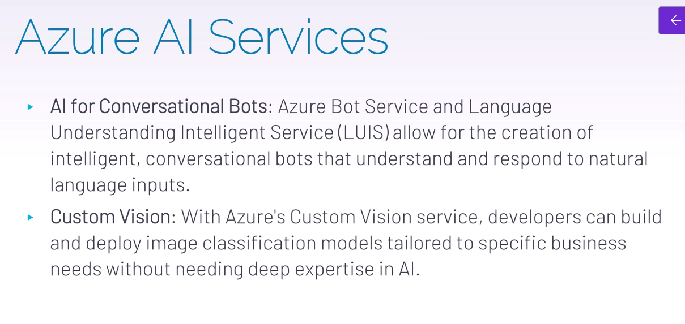
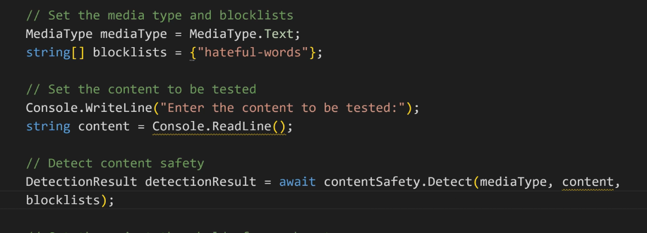
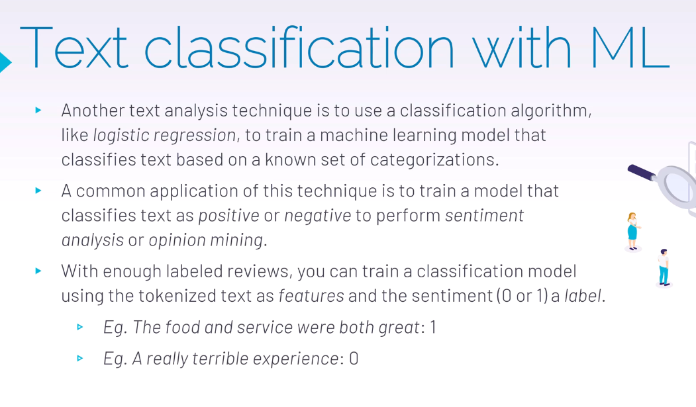
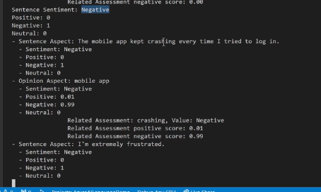
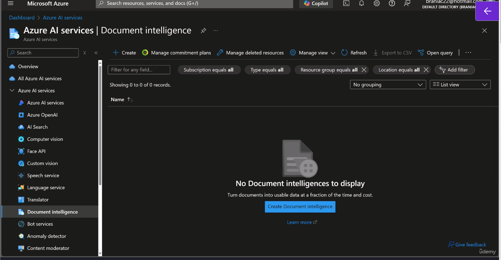
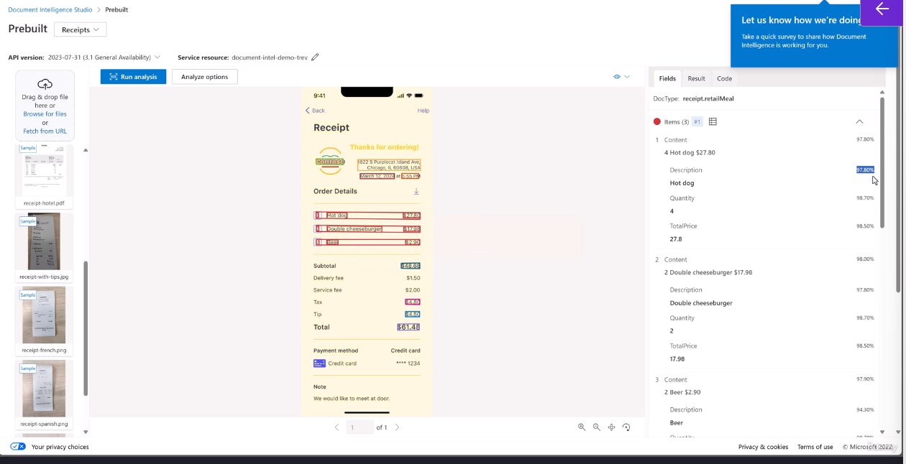
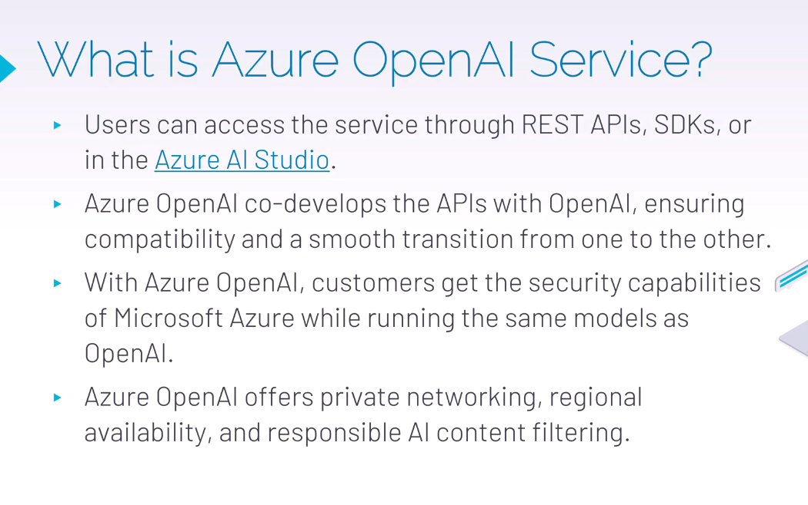
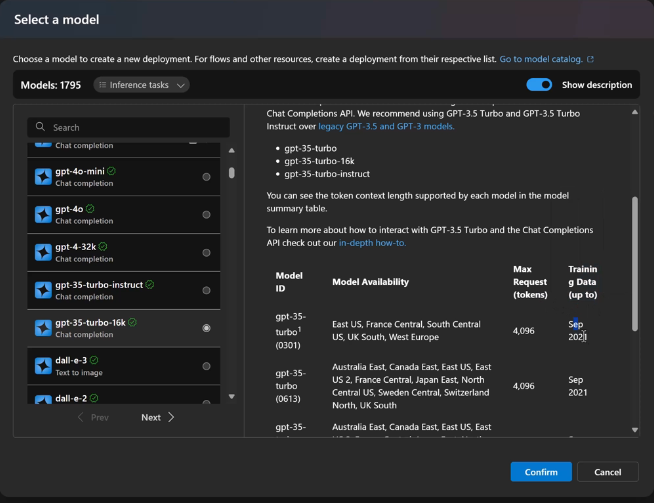
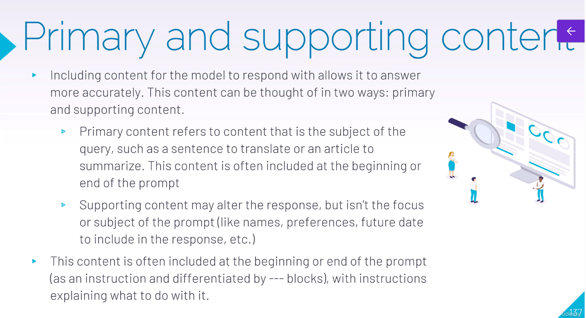
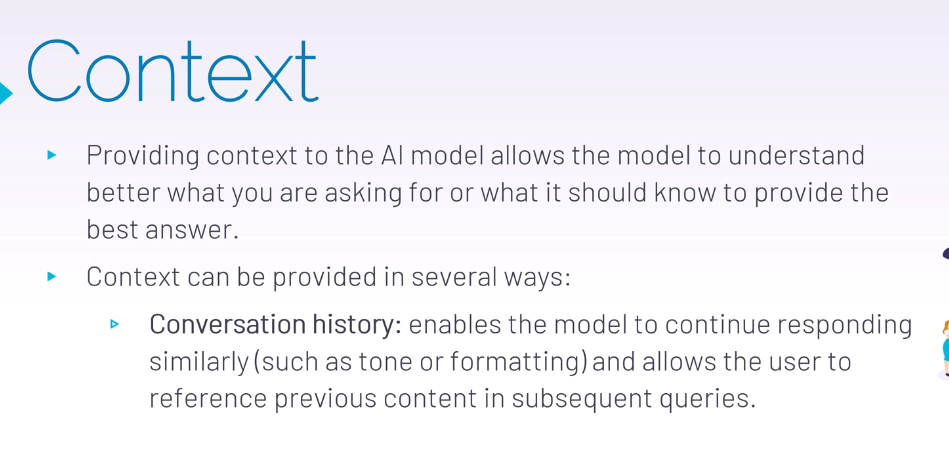

# Generative AI with Azure AI Services
- 
- Machine Learning is a form of AI that is able to learn without explicit programming by human
- Some ML algorithms are specialized in training themselves to detect patterns; this is called deep learning.
- 
- Generative AI is AI capable of creating new content using models trained on existing data.
- It generates text,images, audio and video
- It is powered by advanced machine learning models such as transformers, GANs(Generative Adversarial Networks) and others
- Examples of GenAI are ChatGPT(for text), DALL-E(for images) and MusicLM(for audio)
- GenAI is not fully autonomous. It relies on training data and models built by humans. Cant think or reason independently.
- AI Models can inherit biases from the data they are trained on.
- GenAI content may not always be accurate or reliable. 
- AI is a tool meant to augment human capabilities, not replace them entirely.

## Ethical implications of AI
- AI has potential to unlock all kinds of opportunities for businesses, governments and society.
- It should promote non-discrimination and fairness.
- It should not violate human rights.
- It must minimize environmental impact, reduce carbon footprint
- It should follow privacy and data protection laws
- It should be accountable.


## Machine Learning Basics
- Machine Learning is a form of AI that is able to learn without explicit programming by human
- Some ML algorithms are specialized in training themselves to detect patterns; this is called deep learning.
- 2 types of machine learning: Supervised learning(map points between input and output) and unsupervised learning(discover patterns and relationships using unlabelled data)
- Unsupervised learning tries to find clusters of data
- Additional type of ML is Semi-supervised learning(uses both labelled and unlabelled data)
- We also have reinforcement learning which mimics the trial and error learning process that humans use to achieve their goals e.g autonomous vehicles.
- 
- 
- 

## Understanding Neural Networks
- They are computational models designed to recognize patterns and make decisions based on data. 
- 
- There are two main processes for a neural network.
- There is the forward propagation, where data moves from the input layer through the hidden layers to the output layer and each neuron.
- So each circle here in that hidden layer that represents a neuron, it applies some mathematical function to the input.
- That's where that weighting comes.
- So the higher the mathematical, the output of it or whatever parameters there are to determine what's a good, um, outcome of that mathematical operation or not, it will give it more or less precedence towards a final response.
- We have back propagation where the network adjusts its weights based on the error of its predictions, improving accuracy over time. So that is why you'll see generative AI getting smarter each time as well. And sometimes they ask for feedback.
- 

## Introduction to ML.NET
- Ml.net is an open source, cross-platform machine learning framework that is designed specifically for .Net developers, it allows us to build, train and deploy machine learning models using C# or F#.
- So with this, we also get AutoML capabilities which help us to automatically build and tune models.
- We also have Azure AI Services: Set of cloud based artificial intelligence tools and API that allow us to build AI powered applications without needing in-depth AI expertise.
- Another thing is Semantic Kernel which is an open source framework which allows us to integrate LLMs in our applications through this library.
- We have ONNX(Open Neural Network Exchange): Open source format for representing ML Models.
- We have PyTorch from Facebook and TensorFlow which comes from Google.
- We have CnTk(Microsoft Cognitive Toolkit) from Microsoft for deep learning. Helps to build applications optimized for speech, image recognition and text.
- 
- 
- 
- 
- 
- 
- 
- We have a concept of overfitting, which basically means that the model has been trained on the data a bit too well such that newer data seems like rubbish to it, so we don't want it to be too familiar and too confident with just the data set it got.
```c#
//Use the following code to interact with the Predictive Model and predict values using it
//Load sample data
var sampleData = new PredictiveModel.ModelInput()
{
    UDI = 2F,
    Product_ID = @"L47181",
    Air_temperature = 298.2F,
    Process_temperature = 308.7F,
    Rotational_speed = 1408F,
    Torque = 46.3F,
    Tool_wear = 3F,
};

//Load model and predict output
var result = PredictiveModel.Predict(sampleData);


```

- We can add a machine learning model to our project like this
- 
- Once we train our model with the sample dataset we can use it to predict values like this:
```c#
using MLSampleAppConsole;

//Prompt the user for input values
//Build the input model from values
PredictiveModel.ModelInput modelInput = new()
{
    UDI = 2F,
    Product_ID = @"L47181",
    Air_temperature = 298.2F,
    Process_temperature = 308.7F,
    Rotational_speed = 1408F,
    Torque = 46.3F,
    Tool_wear = 3F,
};

Console.WriteLine("Comparing actual Machine_failure with predicted Machine_failure from sample data...\n\n");


//Passing input values into predictive model
var scoresWithLabel = PredictiveModel.PredictAllLabels(modelInput);

Console.WriteLine($"{"Class",-40}{"Score",-20}");
Console.WriteLine($"{"-----",-40}{"-----",-20}");

foreach (var score in scoresWithLabel)
{
    Console.WriteLine($"{score.Key,-40}{score.Value,-20}");
}
Console.WriteLine($"{"-----",-40}{"-----",-20}");
var modelOutput = PredictiveModel.Predict(modelInput);
Console.WriteLine("Single Prediction Result");
Console.WriteLine($"UDI: {modelOutput.UDI}");
Console.WriteLine($"Product_Id: {modelOutput.Product_ID}");
Console.WriteLine($"Air_Temperature: {modelOutput.Air_temperature}");
Console.WriteLine($"Tool_wear: {modelOutput.Tool_wear}");
Console.WriteLine($"Machine_failure: {modelOutput.Machine_failure}");


Console.WriteLine("------------Done------------");
Console.ReadKey();


```

## Consuming a model from .NET API
- We can use the following code to consume the PredictiveModel like this
```c#
// This file was auto-generated by ML.NET Model Builder. 
using Microsoft.AspNetCore.Builder;
using Microsoft.Extensions.DependencyInjection;
using Microsoft.Extensions.ML;
using Microsoft.OpenApi.Models;
using Microsoft.ML.Data;
using System.Drawing;
using System.IO;
using System.Threading.Tasks;

// Configure app
var builder = WebApplication.CreateBuilder(args);
builder.Services.AddPredictionEnginePool<PredictiveModel.ModelInput, PredictiveModel.ModelOutput>()
    .FromFile("PredictiveModel.mlnet");

builder.Services.AddEndpointsApiExplorer();

builder.Services.AddSwaggerGen(c =>
{
    c.SwaggerDoc("v1", new OpenApiInfo { Title = "My API", Description = "Docs for my API", Version = "v1" });
});
var app = builder.Build();

app.UseSwagger();

if (app.Environment.IsDevelopment())
{
    app.UseSwagger();
    app.UseSwaggerUI(c =>
    {
        c.SwaggerEndpoint("/swagger/v1/swagger.json", "My API V1");
    });
}


// Define prediction route & handler
app.MapPost("/predict",
    async (PredictionEnginePool<PredictiveModel.ModelInput, PredictiveModel.ModelOutput> predictionEnginePool, PredictiveModel.ModelInput input) =>
        await Task.FromResult(predictionEnginePool.Predict(input)));

// Run app
app.Run();


```
## Generative AI Tools and Copilots
- Generative AI helps to create new content
- People interact with generative AI through copilot or ChatGPT.
- They accept natural language input and return appropriate response in natural language, images or code.
- Generative AI applications are powered by language models, a specialized machine learning model that you can use to perform NLP tasks.
- These applications can determine sentiment by classifying natural language text.
- They can also summarize text

### Using language models
- 

### Using Azure OpenAI models
- Azure Open AI hosts pretrained foundational models in Model Catalog of Azure Open AI
- 

### Understanding Copilots
- 
- 
- 
- 
- 
- For inline chat with Copilot click on CTRL + I
- 

## Azure AI Services Fundamentals
- 
- 
- 
- 
- 
- 
- 
- 

### Provision Azure AI Services
- 
- 
- 
- 

### Exploring Content Safety Studio
- 
- Helps to moderate content which is offensive, risky or otherwise undesirable.
- 
- 
- 
- Change Access Control and Add role assignment and choose cognitive services user.
- 
- 
- The model is already kind of trained. Its deep learning and everything on what's safe and unsafe things may look like.
- So you as a developer don't have to worry about training it.
- It's already a well trained model.
- What you can do is configure filters and thresholds so you can say, all right, well I want to block even the lowest amount of violence, or I really only want to block things that are extremely violent.
- 
- 
- 
- 
- We have an endpoint for the content safety studio and we can call it.
- Content Safety Demo is a console application demonstrating how to use Azure Content Safety for text analysis and content moderation. This demo app analyzes text input, detects potentially harmful or inappropriate content, and flags it according to specified safety policies. Ideal for developers and content managers, this application showcases how Azure Content Safety can be integrated into .NET applications to enhance user safety and maintain community guidelines.
```c#
public class Program
{
    static async Task Main(string[] args)
    {
        // Replace the placeholders with your own values
        string endpoint = "";
        string subscriptionKey = "";

        // Initialize the ContentSafety object
        ContentSafety contentSafety = new ContentSafety(endpoint, subscriptionKey);

        // Set the media type and blocklists
        MediaType mediaType = MediaType.Text;
        string[] blocklists = { "hateful-words" };

        // Set the content to be tested
        Console.WriteLine("Enter the content to be tested:");
        string content = Console.ReadLine();

        // Detect content safety
        DetectionResult detectionResult = await contentSafety.Detect(mediaType, content, blocklists);

        // Set the reject thresholds for each category
        Dictionary<Category, int> rejectThresholds = new Dictionary<Category, int> {
            { Category.Hate, 4 }, { Category.SelfHarm, 4 }, { Category.Sexual, 4 }, { Category.Violence, 4 }
        };

        // Make a decision based on the detection result and reject thresholds
        Decision decisionResult = contentSafety.MakeDecision(detectionResult, rejectThresholds);
    }
}


    /// <summary>
    /// Makes a decision based on the detection result and the specified reject thresholds.
    /// Users can customize their decision-making method.
    /// </summary>
    /// <param name="detectionResult">The detection result object to make the decision on.</param>
    /// <param name="rejectThresholds">The reject thresholds for each category.</param>
    /// <returns>The decision made based on the detection result and the specified reject thresholds.</returns>
    public Decision MakeDecision(DetectionResult detectionResult, Dictionary<Category, int> rejectThresholds)
    {
        Dictionary<Category, Action> actionResult = new Dictionary<Category, Action>();
        Action finalAction = Action.Accept;
        foreach (KeyValuePair<Category, int> pair in rejectThresholds)
        {
            if (!VALID_THRESHOLD_VALUES.Contains(pair.Value))
            {
                throw new ArgumentException("RejectThreshold can only be in (-1, 0, 2, 4, 6)");
            }

            int? severity = GetDetectionResultByCategory(pair.Key, detectionResult);
            if (severity == null)
            {
                throw new ArgumentException($"Can not find detection result for {pair.Key}");
            }

            Action action;
            if (pair.Value != -1 && severity >= pair.Value)
            {
                action = Action.Reject;
            }
            else
            {
                action = Action.Accept;
            }
            actionResult[pair.Key] = action;

            if (action.CompareTo(finalAction) > 0)
            {
                finalAction = action;
            }
        }

        // blocklists
        if (detectionResult is TextDetectionResult textDetectionResult)
        {
            if (textDetectionResult.BlocklistsMatch != null &&
                textDetectionResult.BlocklistsMatch.Count > 0)
            {
                finalAction = Action.Reject;
            }
        }

        Console.WriteLine(finalAction);
        foreach (var res in actionResult)
        {
            Console.WriteLine($"Category: {res.Key}, Action: {res.Value}");
        }

        return new Decision(finalAction, actionResult);
    }
}

```
- We can setup blocklists or keywords that we want to block
- Content Safety can even look at images
- 
- 
- 
- 
- 
- 
- 


## Creating solutions with .NET and Azure Cognitive Services
- 
- 
- 
- 
- 
- 
- 

### Text Analysis with Azure AI
- 
- 
- First provision the Azure AI Services
- 
- 
- 
- 
- 
- 
- 
- 
- 
- 
- 
- As we can see it analyzed the sentences and classified whether the sentiment of the sentences was positive or negative.

### Create a Sentiment Analysis application
- 
- 
```c#
using Azure;
using Azure.AI.TextAnalytics;

string key = "MyKey";
string endpoint = "https://az-language-nish.cognitiveservices.azure.com/";


AzureKeyCredential azureKeyCredential = new AzureKeyCredential(key);
Uri languageEndpoint = new Uri(endpoint);

var client = new TextAnalyticsClient(languageEndpoint,azureKeyCredential);

var sentences = new List<string>
{
    "I love the new Italian restaurant. THe pastaa was very good",
    "We need to schedule a meeting to discuss the Q3 projections and finalize the budget"
};


//Pass a single line of text
DocumentSentiment sentenceToAnalyze = client.AnalyzeSentiment(sentences[0]);

//Pass a collection of text
// Summary:
//     Include Opinion Mining = Whether to mine the opinion of a sentence and conduct more granular analysis
//     around the targets of a product or service (also known as Aspect-Based sentiment
//     analysis). If set to true, the returned Azure.AI.TextAnalytics.SentenceSentiment.Opinions
//     will contain the result of this analysis.
AnalyzeSentimentResultCollection sentencesToAnalyze = client.AnalyzeSentimentBatch(sentences,
    options: new AnalyzeSentimentOptions() {IncludeOpinionMining = true });

foreach (AnalyzeSentimentResult sentence in sentencesToAnalyze)
{
    Console.WriteLine($"Sentence Sentiment:{sentence.DocumentSentiment.Sentiment}");

    Console.WriteLine($"Positive:{sentence.DocumentSentiment.ConfidenceScores.Positive}");

    Console.WriteLine($"Neutral:{sentence.DocumentSentiment.ConfidenceScores.Neutral}");

    Console.WriteLine($"Negative:{sentence.DocumentSentiment.ConfidenceScores.Negative}");

    foreach(var sentenceSentiment in sentence.DocumentSentiment.Sentences)
    {
        Console.WriteLine($"Opinion -Aspect: {sentenceSentiment.Text}");

        foreach(var sentenceOpinion in sentenceSentiment.Opinions)
        {
            Console.WriteLine($"Sentence Opinion: {sentenceOpinion.Target.Sentiment}");

            foreach(AssessmentSentiment assessment in sentenceOpinion.Assessments)
            {
                Console.WriteLine($"Opinion assessment: {assessment.Text}");
            }
        }

    }
}


```
- 
- 

## Understanding Computer Vision
- 
- 

## Image Processing through Machine Learning
- 
- 
- Filters modify the image pixels values and create a visual effect around that image.
-  filter is one or more arrays of pixel values which are called pixel kernels.
-  
-  
-  To the left is a grayscale image of what I think is a banana.
- After we have applied that filter, we then see to the right that it has a darker scale on it.
- So now the actual subject of the image has more defined borders and it's very visible to the computer.
- So once again the computer is going to process things differently from how we, the human beings, do.

### How does the Machine Learning and CNN work?
- Step one images with no labels like apples, oranges, bananas, etc. are fed into the network to train the model.
- One or more layers of filters is used to extract features from each image.
- As it is fed through the network, the filter kernels start to randomly assign weights and generate arrays of numeric values called feature maps.
- Then the feature maps are flattened into a single dimensional array of feature values.
- The feature values are then fed into a fully connected neural network, and then the output layer of the neural network uses a softmax or similar function to produce a result that contains a probability value for each possible class.
- 

### Transformers
- 
- 
- 
- This effective means that that we can map features from images to regular text embeddings and build an association between images and natural text.
- This can prove useful in say: captioning images
- 

## Azure AI Vision
- 
- 
- 
- 
- 
- 
- 
- 

### Building an Image Captioning Web Application using Azure AI Vision
- This Image Captioning Web Application uses Azure AI Vision to analyze uploaded images and generate descriptive captions. Users can upload an image through the web interface, and Azure AI Vision’s advanced image processing capabilities will generate an appropriate caption based on the content of the image. This application demonstrates how to integrate Azure’s image analysis features into a modern web application to enhance user engagement and accessibility.
- Image Upload: Users can upload images in various formats (JPEG, PNG, etc.).
- Image Captioning with Azure AI Vision: Automatically generates a descriptive caption for each uploaded image using Azure’s image analysis service.
- Real-Time Caption Display: Displays the generated caption to users in real time, enhancing user experience and accessibility.

#### Example Workflow
- User Uploads Image: The user uploads an image of a sunset over the ocean.
- Azure AI Vision Generates Caption: The backend sends the image to Azure, which analyzes it and returns a caption like “A beautiful sunset over the ocean with colorful skies.”
- Caption Displayed: The caption appears on the webpage below the image, providing the user with meaningful feedback.
- We need to add the nuget package: Azure.AI.Vision.ImageAnalytics
```json

  <ItemGroup>
    <PackageReference Include="Azure.AI.Vision.ImageAnalysis" Version="1.0.0" />
  </ItemGroup>

```
- We can code it as follows:
```html
//Index.cshtml
@page
@model IndexModel
@{
    ViewData["Title"] = "Azure AI Vision Demo";
}

<div class="text-center">
    <h1 class="display-4">Azure AI Vision Demo</h1>
    <p>
        An intelligent app to assess an image generate a caption
    </p>
</div>

<div class="row">
    <div class="col-md-6">
        <form method="post" enctype="multipart/form-data">
            <div class="form-group">
                <label asp-for="Input.Image">Upload Image</label>
                <input asp-for="Input.Image">
            </div>
            <button type="submit" class="btn btn-primary">Submit for Assessment</button>
        </form>
    </div>
    <div class="col-md-6">
        
        <p>@Model.Input.ImageCaption</p>
    </div>


```
```c#

//Index.cshtml.cs
using Azure;
using Azure.AI.Vision.ImageAnalysis;
using Microsoft.AspNetCore.Mvc;
using Microsoft.AspNetCore.Mvc.RazorPages;

namespace AzureComputerVision.Pages;

public class IndexModel : PageModel
{

    private readonly ILogger<IndexModel> _logger;

    public class ImageCaptionModel
    {
        public IFormFile Image { get; set; }
        public string ImageData { get; set; }
        public string ImageCaption { get; set; }
    }

    [BindProperty]
    public ImageCaptionModel Input { get; set; } = new();

    public IndexModel(ILogger<IndexModel> logger)
    {
        _logger = logger;
    }

    public void OnGet()
    {

    }

    public async Task<IActionResult> OnPostAsync()
    {
        string endpointUrl = "";
        string key = "";

        ImageAnalysisClient client = new(new Uri(endpointUrl), new AzureKeyCredential(key));

        if (Input.Image != null)
        {
            using MemoryStream ms = new();
            await Input.Image.CopyToAsync(ms);
            ms.Position = 0;
            Input.ImageData = Convert.ToBase64String(ms.ToArray());

            ImageAnalysisResult imageAnalysisResult = await client.AnalyzeAsync(BinaryData.FromStream(ms), VisualFeatures.Caption, new ImageAnalysisOptions
            {
                GenderNeutralCaption = true
            });

            Input.ImageCaption = $"Caption: {imageAnalysisResult.Caption.Text} | Confidence: {imageAnalysisResult.Caption.Confidence}";

        }

        return Page();
    }
}

```
- 


### Document Intelligence
- 
- 
- We can build models that can process custom forms or documents
- 
- 
- 
- 
- 
- 
- 
- 
- Document Intelligence gives more useful information from the png image we uploaded such as the items in the receipt, can give quantity and price and address of the restaurant.
- 
- It basically extracts json from the document
- 
- It also generates the sample C# code to use the document
- 

### Building a Receipt Analysis Application
- Add the following nuget package:
```json
<ItemGroup>
    <PackageReference Include="Azure.AI.FormRecognizer" Version="4.1.0" />
  </ItemGroup>

```
- This Document Processing Web Application uses Azure AI Document Intelligence (formerly known as Azure Form Recognizer) to analyze uploaded documents, such as receipts, invoices, or other structured forms. The application extracts key information like date, total amount, vendor details, and itemized entries, providing a powerful solution for automating document processing workflows.
- Document Upload: Allows users to upload various types of documents (PDF, JPEG, PNG).
- Automated Data Extraction with Azure AI Document Intelligence: Utilizes Azure’s document analysis capabilities to extract key information from uploaded documents.
- Real-Time Results Display: Displays the extracted data in a structured format on the webpage, providing instant feedback and insights.
- Here is the code
```html
@page
@model IndexModel
@{
    ViewData["Title"] = "Azure Document Intelligence Demo";
}

<div class="text-center">
    <h1 class="display-4">Azure Document Intelligence Demo </h1>
    <p>An intelligent documents and their data using document Intelligence</p>
</div>

<div class="row">
    <div class="col-md-6">
        <form method="post" enctype="multipart/form-data">
            <div class="form-group">
                <label asp-for="Document">Upload Documet</label>
                <input asp-for="Document">
            </div>
            <button type="submit" class="btn btn-primary">Submit for Assessment</button>
        </form>
    </div>
    <div class="col-md-6">
        @if (Model.Result != null)
        {
            <h4>Analysis Result</h4>
            <dl>
                <dt>Merchant Name</dt>
                <dd>@Model.Result.MerchantName</dd>
                <dt>Transaction Date</dt>
                <dd>@Model.Result.TransactionDate</dd>
                <dt>Items</dt>
                <dd>
                    <table class="table">
                        @foreach (var item in Model.Result.Items)
                        {
                            <tr>
                                <td>@item.desc</td>
                                <td>@item.total</td>
                            </tr>
                        }
                    </table>
                </dd>
                <dt>Receipt Total</dt>
                <dd>@Model.Result.Total</dd>
            </dl>
        }
    </div>
</div>


```
- Code for Index.html.cs file is 
```c#
using Azure;
using Azure.AI.FormRecognizer.DocumentAnalysis;
using Microsoft.AspNetCore.Mvc;
using Microsoft.AspNetCore.Mvc.RazorPages;

namespace AzureDocumentIntelligenceDemo.Pages;

public class IndexModel : PageModel
{

    public class AnalysisResult
    {
        public string MerchantName { get; set; } = string.Empty;
        public string TransactionDate { get; set; } = string.Empty;
        public List<(string desc, string total)> Items { get; set; } = [];
        public string Total { get; set; } = string.Empty;
    }
    private readonly ILogger<IndexModel> _logger;

    [BindProperty]
    public IFormFile Document { get; set; }
    public AnalysisResult Result { get; set; } = new AnalysisResult();


    public IndexModel(ILogger<IndexModel> logger)
    {
        _logger = logger;
    }

    public void OnGet()
    {

    }

    public async Task<IActionResult> OnPostAsync()
    {
        string endpoint = "https://document-intel-demo-trev.cognitiveservices.azure.com/";
        string apiKey = "1QbWjZJb65syF8ZJGmiApD8Z0ShmlRfkMpQSiiA7apEZOxElGYZjJQQJ99AKACHYHv6XJ3w3AAALACOGnIOb";

        var credential = new AzureKeyCredential(apiKey);
        var client = new DocumentAnalysisClient(new Uri(endpoint), credential);

        using MemoryStream ms = new();
        await Document.CopyToAsync(ms);
        ms.Position = 0;

        AnalyzeDocumentOperation operation = await client.AnalyzeDocumentAsync(WaitUntil.Completed, "prebuilt-receipt", ms);

        AnalyzeResult receipts = operation.Value;

        foreach (AnalyzedDocument receipt in receipts.Documents)
        {
            if (receipt.Fields.TryGetValue("MerchantName", out DocumentField merchantName))
            {
                if (merchantName.FieldType == DocumentFieldType.String)
                {
                    string merchant = merchantName.Value.AsString();
                    Result.MerchantName = $"Merchant Name: '{merchant}', with confidence {merchantName.Confidence}";
                }
            }

            if (receipt.Fields.TryGetValue("TransactionDate", out DocumentField transactionDate))
            {
                if (transactionDate.FieldType == DocumentFieldType.Date)
                {
                    DateTimeOffset date = transactionDate.Value.AsDate();
                    Result.TransactionDate = $"Transaction Date: '{transactionDate}', with confidence {transactionDate.Confidence}";
                }
            }

            if (receipt.Fields.TryGetValue("Total", out DocumentField total))
            {
                if (total.FieldType == DocumentFieldType.Double)
                {
                    double amount = total.Value.AsDouble();
                    Result.Total = $"Total: '{amount}', with confidence '{total.Confidence}'";
                }
            }

            if (receipt.Fields.TryGetValue("Items", out DocumentField itemsField))
            {
                if (itemsField.FieldType == DocumentFieldType.List)
                {
                    foreach (DocumentField itemField in itemsField.Value.AsList())
                    {
                        string Description = string.Empty;
                        string TotalPrice = string.Empty;

                        if (itemField.FieldType == DocumentFieldType.Dictionary)
                        {
                            IReadOnlyDictionary<string, DocumentField> itemFields = itemField.Value.AsDictionary();

                            if (itemFields.TryGetValue("Description", out DocumentField itemDescriptionField))
                            {
                                if (itemDescriptionField.FieldType == DocumentFieldType.String)
                                {
                                    string itemDescription = itemDescriptionField.Value.AsString();

                                    Description = $"  Description: '{itemDescription}', with confidence {itemDescriptionField.Confidence}";
                                }
                            }

                            if (itemFields.TryGetValue("TotalPrice", out DocumentField itemTotalPriceField))
                            {
                                if (itemTotalPriceField.FieldType == DocumentFieldType.Double)
                                {
                                    double itemTotalPrice = itemTotalPriceField.Value.AsDouble();

                                    TotalPrice = $"  Total Price: '{itemTotalPrice}', with confidence {itemTotalPriceField.Confidence}";
                                }
                            }
                        }
                        Result.Items.Add((Description, TotalPrice));
                    }
                }
            }
        }

        return Page();
    }
}


```
- 

## Azure Machine Learning
- 
- Azure ML is a cloud-based service that streamlines the ML process, allowing users to focus on building and deploying intelligent applications.
- 
- 
- 
- 
- 
- 
- 
- 
- 
- 
- 
- 
- Here rentals is our label(output) and the rest are features(input)
- 
- 
- 
- 
- 
- An ML Table file is a specific data format used in Azure Machine Learning (Azure ML) to represent tabular data in a way that’s optimized for machine learning workflows. It’s not a widely recognized standalone file type outside Azure ML but is part of its ecosystem to streamline data handling, especially for tasks like training models (e.g., your earlier question about transformers for image labeling) or running data pipelines.
- It consists of:
- A schema file: Typically a YAML file (e.g., mltable.yaml) that defines the structure, data types, and location of the underlying data.
- Underlying data: The actual tabular data, which can be stored in formats like CSV, Parquet, or Delta, and hosted in places like Azure Blob Storage, Data Lake, or even local storage.
- 
- 
- 
- 
- 
- Random Forest is a commonly used machine learning algorithm that combines the output of multiple decision trees to reach a single result.
- LightGBM also uses decision tree based algorithms, and it basically does ranking and classification for other for machine learning tasks.
- 
- 
- 
- 
- 
- 
- 
- 
- 
- Deploy to a real-time endpoint
- 
- 
- 
- 

## Test endpoint in Console App
- 
- 
- 
- 
- 

## Creating GenAI Solutions using .NET and Azure OpenAI
- 
- 
- 
- 
- 
- 
- 
- Azure AI Foundry is used for Azure Cognitive Services also
- 
- 
- 
- 
- 
- 
- Each prompt is appended with a particular system message to provide context for model responses and sets some context as to how the model should interact and respond.
- 
- 
- 
- 
- 
- 
- 
- 
- It will launch as an Azure Web Application
- 
- 
- We need to modify the application logic to add our own context and we can customize our chatbot as per our needs.
- 
- 

### Prompt Engineering
- 
- 
- 
- 
- 
- 
- 
- 
- 
- Install the nuget package Azure.AI.OpenAI
- This application will now interact with our deployed chatgpt model on Azure AI Foundry.
```c#
//Create a Chatbot to interact with the deployed model

using System;
using System.Threading.Tasks;
using Azure;
using Azure.AI.OpenAI;
using OpenAI.Chat;


class Program
{
    static async Task Main()
    {
        // Configure Azure OpenAI details
        string endpoint = "https://YOUR_AZURE_OPENAI_ENDPOINT.openai.azure.com/";
        string apiKey = "YOUR_AZURE_OPENAI_API_KEY";
        string deploymentName = "gpt-35-turbo-16k";  // Example: "gpt-4-turbo"

        AzureKeyCredential credential = new AzureKeyCredential(apiKey);
        // Create OpenAI client
        AzureOpenAIClient azureClient = new (new Uri(endpoint), credential);
        ChatClient chatClient = azureClient.GetChatClient(deploymentName);
        string systemMessage = "You are a senior developer with 10 years of .NET development experience. Have a good sense of humor";

        Console.WriteLine("Azure OpenAI ChatBot - Type 'exit' to quit.");
        while (true)
        {
            Console.Write("You: ");
            string userInput = Console.ReadLine();

            if (string.IsNullOrWhiteSpace(userInput) || userInput.ToLower() == "exit")
                break;

            // Send user input to Azure Open AI
            ChatCompletion completion = await chatClient.CompleteChatAsync(
                new SystemChatMessage(systemMessage),
                new UserChatMessage("Hi, can you help me"),
                new AssistantChatMessage("Yes, of course how can i mentor you today"),
                new UserChatMessage(userInput)
                );

            //Output the response content
            Console.WriteLine($"AI: {completion.Content[0].Text}\n");
        }
    }
}

```

### Code Generation
- 
- 
- 
- 
- 
- 

### DALL-E Model
- 
- 
- 
- 
- 
- 
- 
```html
@page
@model IndexModel
@{
    ViewData["Title"] = "DALL E Web Demo";
}

<div class="text-center">
    <h1 class="display-4">DALL E Web Demo</h1>
    <p>Learn how to generatem images in your web app using DALL-E</a>.</p>
</div>
<div class="row">
    <div class="col-6">

    <form method="post">
            <div class="form-group">
                <label asp-for="Prompt" class="control-label"></label>
                <input asp-for="Prompt" class="form-control"></input>
                <span asp-validation-for="Prompt" class="text-danger"></span>
                </div>
               <button type="submit" class="btn btn-primary">Generate Image</button>

    </form>
    </div>
    <div class="col-6">
        <p>Original Prompt: @Model.Prompt</p>
        <p>Revised Prompt: @Model.RevisedPrompt</p>
        <hr/>
        
    </div>
    </div>


```
- Code behind would be:
```c#
using Azure;
using Azure.AI.OpenAI;
using Microsoft.AspNetCore.Mvc;
using Microsoft.AspNetCore.Mvc.RazorPages;
using OpenAI.Images;

namespace DallEWebApp.Pages
{
    public class IndexModel : PageModel
    {
        private readonly ILogger<IndexModel> _logger;

        [BindProperty]
        public string Prompt { get; set; }
        public string ImageUrl { get; set; }

        public string RevisedPrompt { get; set; }

        public IndexModel(ILogger<IndexModel> logger)
        {
            _logger = logger;
        }

        public void OnGet()
        {

        }

        public async Task<IActionResult> OnPostAsync()
        {
            string endpoint = "";
            string apiKey = "";
            AzureOpenAIClient azureClient = new(new Uri(endpoint), new AzureKeyCredential(apiKey));
            ImageClient imageClient = azureClient.GetImageClient("deployment-name ");//Name of the deployed DALL-E model

            var imageGenerationResult = await imageClient.GenerateImageAsync(Prompt,
                new ImageGenerationOptions
                {
                    Size = GeneratedImageSize.W1024xH1024

                });

            ImageUrl = imageGenerationResult.Value.ImageUri.ToString();
            RevisedPrompt = imageGenerationResult.Value.RevisedPrompt;

            return Page();
        }
    }
}


```
- 

## Understanding Retrieval Augment Generation(RAG)
- 
- 

### Retrieval Augmentation Generation(RAG) with AI Studio
- 
- 
- Create a Storage Account also to store the actual data
- 
- Upload some ebooks to the blob container
- 
- Deploy a model called text-embedding-ada-002
- 
- 
- Now we have 2 models deployed gpt-35-turbo and text-embedding-ada-002
- Now we will create an AI Search Index
- Go to the Azure AI Search Service
- Select Import and Vectorize Data
- 
- Choose the Azure Blob Storage
- 
- Select the Model as text-embedding-ada-002 to do the vectorization
- 
- Enable Semantic Ranking
- 
- 
- We can then start searching
- 
- It is looking through blocks of text trying to find the memory leak
- We will go back to our model gpt-35-turbo that we deployed earlier.
- Now to perform RAG, we need to provide it a datasource so that we can ask questions on our own data.
- 
- 
- 
- 
- 
- Now we have a datasource associated with our already deployed model.
- Now we update the context for the model
- 
- 
- 
- Now it gives citations also to the ebooks we uploaded.
- 
- 
- So in a matter of few clicks we have setup an entire RAG model, this model vectorizes ebooks and stores them in Azure AI Search. This is fed as data source to our earlier deployed gpt-35-turbo model and in addition to the knowledge capabilities of gpt-35-turbo we have now augmented its results with the text found in the ebooks we uploaded.
- Now we will create a console app that interacts with this RAG model
- First find the endpoint of azure ai search
- 
- Then go to Indexes and copy the index value
- 
- Now get the admin keys
- 
- We can make a console app like this to interact with this RAG Model
```c#
using Azure;
using Azure.AI.OpenAI;
using Azure.AI.OpenAI.Chat;
using OpenAI.Chat;

# pragma warning disable AOAI001

string endpoint = "";
string key = "";
string azureSearchEndpoint = "https://ai-search-nishant.search.windows.net";
string azureSearchKey = "";
string azureSearchIndex = "azuresearchindex";

AzureKeyCredential credential = new AzureKeyCredential(key);
AzureOpenAIClient azureClient = new AzureOpenAIClient(new Uri(endpoint), credential);
ChatClient chatClient = azureClient.GetChatClient("gpt-35-turbo-16k");

ChatCompletionOptions chatOptions = new();

//Configure the data source that we will use to answer the question
//In this case, we are using Azure Search as the data source
//Note that this helps to us to do Retrieval Augmented Generation (RAG) using Azure Search
chatOptions.AddDataSource(new AzureSearchChatDataSource()
{
    Endpoint = new Uri(azureSearchEndpoint),
    IndexName = azureSearchIndex,
    Authentication = DataSourceAuthentication.FromApiKey(azureSearchKey),
});

Console.WriteLine("Enter your question(type 'quit' to exit): ");
string userPrompt = Console.ReadLine() ?? string.Empty;

ChatCompletion completion = await chatClient.CompleteChatAsync(
    //Collection of User Chat Messages
    [
    new UserChatMessage(userPrompt)
    ],
    chatOptions);

ChatMessageContext chatContext = completion.GetMessageContext();
if(chatContext?.Intent is not null)
{
    Console.WriteLine($"Intent: {chatContext.Intent}");
}

//This is effective used to provide reference of the ebooks we had uploaded and vectorized earlier
foreach(ChatCitation citation in chatContext?.Citations ?? Enumerable.Empty<ChatCitation>())
{
    
    Console.WriteLine($"Citation: {citation.Content}");
    Console.WriteLine($"Citation URL: {citation.Url}");
}

```
- 


## Review of the Course
- 
- 
- 
- 
- 
- 