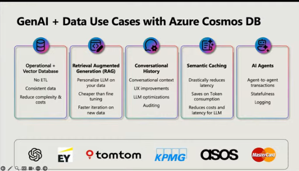
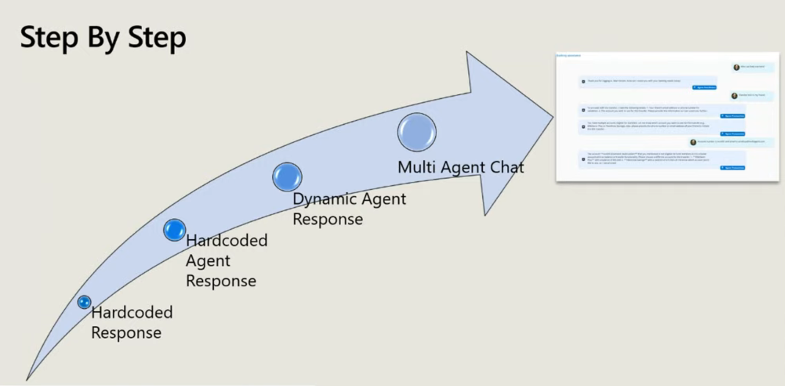
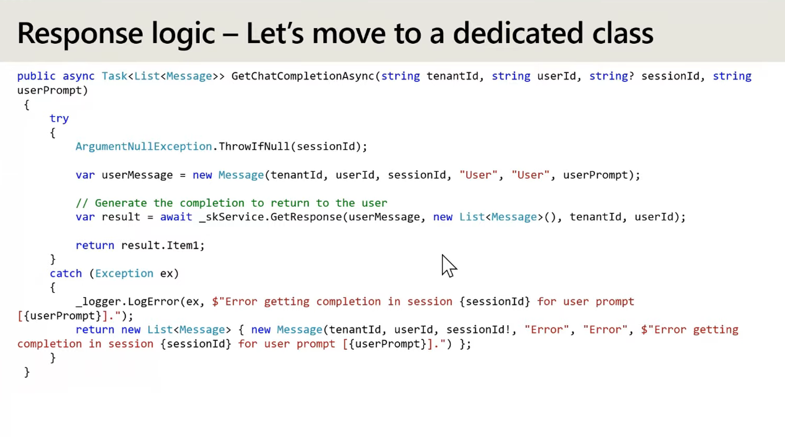
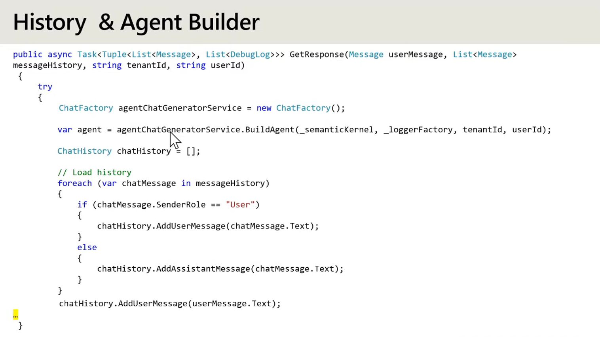

# Semantic Kernel with C# to build multi-agent AI applications powered by Azure Cosmos

Hi, if we to build a mental model of what Semantic Kernel does, how would you describe it

- 
- 
- 
- 
- 
- 

### Semantic Kernel
- 
- Similar to langchain or lang-graph
- 
- 
- Function calling is similar to Tools that are accessed by the Agents
- 
- 
- 
- 

### Demo of a MultiAgent App for a Banking Scenario
- 
- 
- 
- 
- 

### Code Walkthrough
- 
- 
- 
- 
- 
- 
- 
- LLM is stateless so we have to keep track of history and provide the agent the same so that it can respond accordingly.
- 
- 
- Dont include your prompty files inside the code. Store them inside a database or blob storage
- 
- 
- 
- 
- 
- 
- 
- 
- 
- 
- 
- 
- 
- 